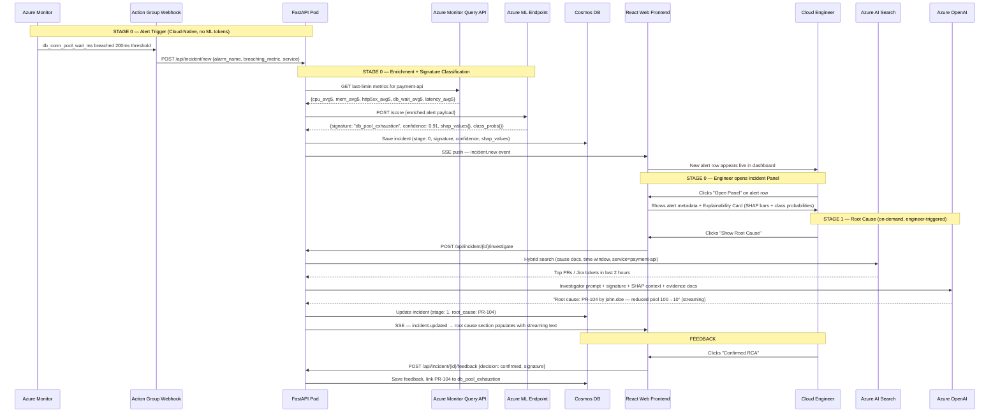

# AI Incident RCA Engine — System Architecture (v4)

> **Purpose**: This document details the complete system architecture for the **Contextual Incident Root Cause Analysis (RCA) Engine** — an AI platform that takes a cloud-native alert as its entry point, classifies it into a known incident signature, investigates the root cause using an **autonomous LangGraph SRE agent** equipped with multi-source platform tools, and surfaces everything through a **custom web frontend** with a built-in LLM chat interface.
>
> **Key Design Changes**:
> - **v2 change**: Anomaly *detection* is entirely delegated to **Azure Monitor Alert Rules**. The ML model classifies *what kind* of incident this is — a multi-class signature classification task.
> - **v3 change**: The Slack/Teams ChatOps output is replaced by a **custom web frontend** (React/Vite). Engineers interact with alerts, view model explainability details, trigger root cause analysis, and view remediation steps — all within a single incident panel in the web UI.
> - **v4 change**: The monolithic backend is split into **two microservices**. A new stateless **Agentic Investigator** service (`backend-investigator`) powered by **LangGraph** replaces the deterministic RAG-only investigation. The agent autonomously queries Azure platform APIs (Activity Logs, Monitor Metrics, Network Watcher Flow Logs, Resource Health) in addition to the AI Search knowledge base, enabling root-cause diagnosis of incidents that have **no associated code change** (e.g., manual portal actions, traffic surges, external outages).

---

## Table of Contents

1. [System Overview](#1-system-overview)
2. [Architecture: Before vs. After (v1 → v3)](#2-architecture-before-vs-after)
3. [Data Architecture](#3-data-architecture)
4. [Layer 0 — Cloud-Native Alert Trigger (Azure Monitor)](#4-layer-0--cloud-native-alert-trigger)
5. [Layer 1 — ML Signature Classifier](#5-layer-1--ml-signature-classifier)
6. [Layer 2 — RAG Knowledge Base](#6-layer-2--rag-knowledge-base)
7. [Layer 3 — LLM Reasoning Engine](#7-layer-3--llm-reasoning-engine)
8. [Layer 4 — Custom Web Frontend](#8-layer-4--custom-web-frontend)
9. [Authentication Strategy](#9-authentication-strategy)
10. [End-to-End Flow (Sequence Diagram)](#10-end-to-end-flow)
11. [Infrastructure Changes Required](#11-infrastructure-changes-required)
12. [Repository & CI/CD Adaptations](#12-repository--cicd-adaptations)
13. [Cost & Token Optimization Strategy](#13-cost--token-optimization-strategy)

---

## 1. System Overview

### What the System Does

The RCA Engine is a **signal-to-diagnosis** pipeline. It does NOT attempt to detect anomalies — the cloud monitoring platform already does that. Instead, once an alert fires, the system immediately answers two questions:

> **"What *type* of incident is this?"** → answered by the ML Signature Classifier  
> **"What caused it and how do I fix it?"** → answered by the RAG + LLM pipeline

| Layer | Technology | Role | Analogy |
|---|---|---|---|
| **Layer 0 — The Alarm** | Azure Monitor Alert Rule | Detects metric threshold breach and fires a webhook to trigger the pipeline | The fire alarm on the wall |
| **Layer 1 — The Diagnostician** | XGBoost Multi-Class Classifier (Azure ML) | Reads the alert payload + context metrics and classifies it into a known **incident signature** | A doctor matching symptoms to a known diagnosis |
| **Layer 2 — The Evidence Room** | Azure AI Search (RAG Vector DB) | Retrieves recent PRs, Jira tickets, Terraform diffs, and Runbooks *matching the classified signature* | A filing cabinet of evidence, pre-organized by incident type |
| **Layer 3 — The SRE Agent** | LangGraph + Azure OpenAI (GPT-4o) | An **autonomous agentic investigator** that uses 7 platform tools (AI Search, Activity Logs, Monitor Metrics, Network Flows, Resource Health, Autoscale Events, NSG Changes) to diagnose root causes — including incidents with no code changes | A senior SRE with access to every Azure diagnostic tool |
| **Layer 4 — The Dashboard** | React / Vite Web App | Displays live alerts, model explainability, on-demand agentic RCA, and a conversational chat interface — all within a single incident panel | An SRE war room with every tool on one screen |

### What "Incident Signature" Means

An **incident signature** is a named, pre-defined class of infrastructure failure pattern. Each class has a recognizable combination of metric behaviors:

| Signature Class | Key Metrics Pattern | Example |
|---|---|---|
| `db_pool_exhaustion` | `db_conn_pool_wait_ms` ↑↑, `request_latency_p99` ↑ | Payment API DB connections spike |
| `memory_leak_progressive` | `memory_percent` slowly ↑↑ over hours | Long-running worker accumulates heap |
| `cpu_saturation_burst` | `cpu_percent` → 99%, `http_5xx_rate` ↑ | Traffic spike overwhelms pod |
| `cascade_failure` | All metrics spike simultaneously | Downstream dependency taken offline |
| `network_partition` | `http_5xx_rate` ↑↑, latency ↑↑, CPU normal | ACL/firewall change blocked traffic |
| `normal_noisy` | Mild transient spikes, no sustained breach | False positive from a deployment restart |

> [!IMPORTANT]
> **Classification ≠ Detection.** The model does not decide whether something is wrong — the CloudWatch/Azure Monitor alarm already made that call. The model only decides *which named signature* best fits the incoming alert context. This is a supervised multi-class classification problem with clean, human-curated labels.

### The 3-Stage Interactive Flow

```
┌─────────────────────────────────────────────────────────────────────────────┐
│  ALERT DASHBOARD — Incident List                                             │
│  ┌──────────────────────────────────────────────────────────────────────┐   │
│  │ 🔴 [P1] payment-api — db_conn_pool_wait_ms > 200ms (342ms) — 2m ago  │   │
│  │     Signature: db_pool_exhaustion   Confidence: 91%   [ Open Panel ] │   │
│  └──────────────────────────────────────────────────────────────────────┘   │
│  ┌──────────────────────────────────────────────────────────────────────┐   │
│  │ 🟡 [P2] auth-service — memory_percent > 80% (88%) — 15m ago          │   │
│  │     Signature: memory_leak_progressive   Confidence: 78%             │   │
│  └──────────────────────────────────────────────────────────────────────┘   │
└─────────────────────────────────────────────────────────────────────────────┘
          ↓ engineer clicks "Open Panel"
┌─────────────────────────────────────────────────────────────────────────────┐
│  INCIDENT PANEL — INC-001 / payment-api                                      │
│  ─────────────────────────────────────────────────────────────────────────  │
│  📍 Signature: db_pool_exhaustion       🎯 Confidence: 91%                  │
│  ─────────────────────────────────────────────────────────────────────────  │
│  MODEL EXPLAINABILITY                                                        │
│  ┌──────────────────────────────────────────────────────────────────────┐   │
│  │  Top features driving this classification:                            │   │
│  │  ① db_wait_avg5 = 342ms         ████████████████░░░░  +0.82 SHAP    │   │
│  │  ② breaching_metric = db_wait   ████████████░░░░░░░░  +0.61 SHAP    │   │
│  │  ③ db_wait_to_cpu_ratio = 28.5  ████████░░░░░░░░░░░░  +0.44 SHAP    │   │
│  │  ④ cpu_avg5 = 12%               ██░░░░░░░░░░░░░░░░░░  -0.12 SHAP    │   │
│  │                                                                       │   │
│  │  Other class probabilities:                                           │   │
│  │  cascade_failure 3% | cpu_saturation_burst 1% | network_partition 1% │   │
│  └──────────────────────────────────────────────────────────────────────┘   │
│  [ 🔍 Show Root Cause ]   [ 🔕 Mark as Maintenance ]                        │
└─────────────────────────────────────────────────────────────────────────────┘
          ↓ engineer clicks "Show Root Cause"
┌─────────────────────────────────────────────────────────────────────────────┐
│  INCIDENT PANEL — INC-001  [Alert ✓] [Root Cause ✓]                        │
│  ─────────────────────────────────────────────────────────────────────────  │
│  📋 ROOT CAUSE ANALYSIS                                                      │
│  Most likely cause: PR #104 by john.doe (merged 12 min ago)                 │
│  Change: Reduced DB max pool size from 100 → 10 in config/db.yml            │
│  Correlation: Pool wait spiked within 2 minutes of the merge.               │
│                                                                             │
│  Runbook identified: RB-012 — DB Pool Exhaustion Recovery                   │
│  Remediation options:                                                       │
│    Option A: Revert PR-104  →  git revert <sha> && git push                 │
│    Option B: kubectl set env deployment/payment-api DB_MAX_POOL=50          │
│    Option C: kubectl rollout restart deployment/payment-api                 │
│  ─────────────────────────────────────────────────────────────────────────  │
│  [ ✅ Confirmed RCA ]    [ ❌ False Alarm ]    [ ✏️ Correct Signature ]      │
└─────────────────────────────────────────────────────────────────────────────┘
```

> [!TIP]
> **Why not detect anomalies ourselves?** Azure Monitor is purpose-built, highly tuned, and requires zero ML maintenance overhead. Rebuilding detection from scratch would be reinventing the wheel at lower quality. Our value-add is the *classification*, *diagnosis*, and *conversational follow-up* that happens *after* the alarm fires — tasks that cloud monitoring platforms cannot do natively.

---

## 2. Architecture: Before vs. After

### What Changed in v2

| Aspect | v1 (Custom Anomaly Detection) | v2 (CloudWatch-Triggered Classification) |
|---|---|---|
| **Who detects anomalies?** | Custom XGBoost binary classifier, polling every 1 min | **CloudWatch / Azure Monitor** — native, threshold-based, no ML required |
| **ML model task** | Binary: `is_anomaly` (0/1) | **Multi-class**: `incident_signature` (6 classes) |
| **ML model trigger** | Continuous AKS CronJob polling every 1 minute | **Event-driven**: Only invoked when a cloud alert fires |
| **ML inputs** | Raw telemetry (cpu, mem, http_5xx, latency, db_wait) | Alert payload payload + enriched context metrics snapshot |
| **ML output** | `is_anomaly`, `anomaly_score` | `incident_signature`, `confidence`, `class_probabilities[6]` |
| **Training labels** | `is_anomaly` binary column | `incident_signature` named class column (6 values) |
| **Training data complexity** | Simple binary labeling (0/1) | Richer: curated examples of each named failure pattern |
| **Infrastructure overhead** | Requires always-on CronJob pod | No CronJob needed — alert webhook is the trigger |
| **Alert fatigue risk** | Model can produce false positives | Cloud monitor alarms are pre-tuned per service SLA |

### Architecture Diagram

```mermaid
graph TD
    subgraph \"Layer 0 — Cloud Alert\"
        AZM[Azure Monitor Alert Rule]
        WH[Action Group Webhook]
    end

    subgraph \"Service A — Core API\"
        API[\"FastAPI /api/incident/new\"]
        MON[Azure Monitor Query API]
        MLEP[\"Azure ML Endpoint - XGBoost\"]
        CDB[Cosmos DB]
    end

    subgraph \"Service B — Agentic Investigator\"
        AGENT[\"LangGraph Agent\"]
        T1[search_code_changes]
        T2[query_activity_logs]
        T3[query_metrics]
        T4[check_resource_health]
        T5[check_autoscale_events]
        T6[check_network_changes]
        T7[query_netflow_logs]
    end

    subgraph \"Data Sources\"
        AIS[Azure AI Search]
        LAW[Log Analytics Workspace]
    end

    subgraph \"Frontend\"
        UI[\"React / Vite Dashboard\"]
        ENG[Cloud Engineer]
    end

    AZM -->|\"metric breach\"| WH
    WH -->|\"POST webhook\"| API
    API --> MON
    API --> MLEP
    API -->|\"HTTP POST context\"| AGENT
    AGENT --> T1 & T2 & T3 & T4 & T5 & T6 & T7
    T1 --> AIS
    T2 & T3 & T7 --> LAW
    AGENT -->|\"root_cause_summary\"| API
    API --> CDB
    CDB --> UI
    UI --> ENG

    style AGENT fill:#7c3aed,color:#fff,stroke:#5b21b6
    style API fill:#0ea5e9,color:#fff,stroke:#0284c7
    style AIS fill:#059669,color:#fff,stroke:#047857
    style LAW fill:#059669,color:#fff,stroke:#047857
```

---

## 3. Data Architecture

### 3.1 Telemetry Snapshot (Alert Payload + Context)

When CloudWatch fires an alarm, it sends a payload with the breaching metric. The FastAPI `/api/incident/new` handler **enriches** this with a context snapshot from the monitoring API (last 5 minutes of all related metrics). This enriched snapshot is what the ML classifier receives.

| Field | Source | Description |
|---|---|---|
| `alert_id` | CloudWatch / Azure Monitor | Unique alarm identifier |
| `alarm_name` | CloudWatch / Azure Monitor | e.g. `payment-api-db-pool-wait-high` |
| `breaching_metric` | CloudWatch / Azure Monitor | e.g. `db_conn_pool_wait_ms = 342ms` |
| `service_name` | Alarm tag / SNS metadata | e.g. `payment-api` |
| `alert_severity` | Alarm config | `P1 / P2 / P3` |
| `cpu_percent_avg5` | Azure Monitor API / CloudWatch GetMetricData | Rolling 5-min average |
| `memory_percent_avg5` | Azure Monitor API / CloudWatch GetMetricData | Rolling 5-min average |
| `http_5xx_rate_avg5` | Azure Monitor API / CloudWatch GetMetricData | Rolling 5-min average |
| `db_conn_pool_wait_avg5` | Azure Monitor API / CloudWatch GetMetricData | Rolling 5-min average |
| `request_latency_p99_avg5` | Azure Monitor API / CloudWatch GetMetricData | Rolling 5-min average |
| `alert_timestamp` | CloudWatch / Azure Monitor | ISO 8601 timestamp |

> [!NOTE]
> The FastAPI handler directly calls the CloudWatch / Azure Monitor API to populate these `*_avg5` fields immediately after receiving the webhook alert. This happens identically in both the POC and Production environments.

### 3.2 Training Dataset (`telemetry_labeled.csv`)

This is the labeled dataset used to train the signature classifier. Each row represents a **historical incident snapshot** with a human-verified signature label.

| Column | Type | Description | Example Values |
|---|---|---|---|
| `timestamp` | datetime | When the alert fired | `2026-03-15T14:22:00Z` |
| `service_name` | string | Affected service | `payment-api`, `auth-service` |
| `breaching_metric` | string | Primary metric that breached | `db_conn_pool_wait_ms` |
| `cpu_percent_avg5` | float | 5-min avg CPU | 15–99% |
| `memory_percent_avg5` | float | 5-min avg Memory | 40–95% |
| `http_5xx_rate_avg5` | float | 5-min avg 5xx error rate | 0–50 |
| `db_conn_pool_wait_avg5` | float | 5-min avg DB wait | 1–450ms |
| `request_latency_p99_avg5` | float | 5-min avg P99 latency | 45–2500ms |
| `incident_signature` | **string (label)** | Human-verified incident class | `db_pool_exhaustion`, `memory_leak_progressive`, `cpu_saturation_burst`, `cascade_failure`, `network_partition`, `normal_noisy` |
| `incident_id` | string | Links row to RAG evidence docs | `INC-001`, `INC-002`, … |

> [!IMPORTANT]
> The `incident_signature` column is the **classification target**. Labels are curated by the SRE team based on historical post-mortems, runbooks, and resolved incidents. This is the key MLOps investment: building and maintaining a high-quality labeled dataset over time.

### 3.3 Knowledge Base (`rag_context.json`)

Each document in the RAG store has a new field: `incident_signature`. This enables **filtered retrieval** — when the classifier returns `db_pool_exhaustion`, the RAG search immediately narrows to documents tagged with that signature.

```json
{
  "id": "uuid",
  "content": "PR #104: Optimize DB connections...",
  "code_diff": "- max_connections: 100\n+ max_connections: 10", 
  "embedding": [1536],
  "doc_type": "github_pr | runbook | jira_ticket | terraform_pr",
  "incident_signature": "unknown | db_pool_exhaustion", 
  "service_affected": "payment-api",
  "author": "john.doe",
  "timestamp": "2026-04-04T06:18:44",
  "incident_id": "INC-001"
}
```

> [!TIP]
> The `incident_signature` field is the most important addition in v2. It allows the RAG search to skip semantic similarity entirely for the first filter, dramatically improving retrieval precision: the system goes straight to "show me all PRs tagged `db_pool_exhaustion` in the last 2 hours" before applying vector similarity.

### 3.4 Cosmos DB Incident Document Schema

```json
{
  "incident_id": "INC-001",
  "alert_source": "cloudwatch | azure_monitor",
  "alarm_name": "payment-api-db-pool-wait-high",
  "breaching_metric": "db_conn_pool_wait_ms = 342ms",
  "service": "payment-api",
  "alert_severity": "P1",
  "detected_at": "2026-04-04T06:48:44Z",
  "classified_signature": "db_pool_exhaustion",
  "signature_confidence": 0.91,
  "class_probabilities": {
    "db_pool_exhaustion": 0.91,
    "memory_leak_progressive": 0.04,
    "cascade_failure": 0.03,
    "cpu_saturation_burst": 0.01,
    "network_partition": 0.01,
    "normal_noisy": 0.0
  },
  "stage_reached": "stage_2_solution",
  "root_cause_identified": "PR-104",
  "engineer_feedback": "confirmed_rca",
  "conversation": [
    { "stage": 0, "type": "alert", "content": "CloudWatch: DB wait > 200ms on payment-api" },
    { "stage": 0, "type": "classification", "content": "Signature: db_pool_exhaustion (91% confidence)" },
    { "stage": 1, "type": "investigation", "content": "PR-104 by john.doe..." },
    { "stage": 2, "type": "solution", "content": "Runbook RB-012 recommends..." }
  ],
  "resolved_at": "2026-04-04T07:02:00Z",
  "tokens_consumed": { "stage_1": 450, "stage_2": 820 }
}
```

---

## 4. Layer 0 — Cloud-Native Alert Trigger

### 4.1 How CloudWatch / Azure Monitor Fires the Pipeline

The system is **entirely event-driven**. There is no polling, no CronJob, no continuous ML inference loop. The pipeline only activates when the cloud provider's native alerting decides a threshold has been breached.

```
┌──────────────────────────────────────────────────────────────────────┐
│  CLOUD MONITORING LAYER (No custom code, managed by ops team)        │
│                                                                       │
│  CloudWatch Metric Alarm:                                             │
│    AlarmName: payment-api-db-pool-wait-high                           │
│    Metric: db_conn_pool_wait_ms                                       │
│    Threshold: > 200ms for 3 consecutive 1-minute datapoints          │
│    Action: → Publish to SNS Topic: rca-engine-alerts                 │
│                                                                       │
│  Azure Monitor Alert Rule (equivalent):                               │
│    Signal: db_conn_pool_wait_ms                                       │
│    Condition: > 200ms for 3 minutes                                   │
│    Action Group: → POST webhook to FastAPI /api/incident/new          │
└──────────────────────────────────────────────────────────────────────┘
         │
         │  Webhook / SNS → EventBridge → API Gateway → FastAPI
         ▼
┌──────────────────────────────────────────────────────────────────────┐
│  FastAPI /api/incident/new                                            │
│                                                                       │
│  1. Parse the alert payload                                           │
│  2. Fetch context metrics from Monitoring API (last 5 min avg)       │
│  3. POST enriched payload → Azure ML Endpoint (classifier)           │
│  4. Receive: { signature: "db_pool_exhaustion", confidence: 0.91 }   │
│  5. Save incident to Cosmos DB (stage 0)                             │
│  6. Send Stage 0 alert to Slack/Teams with [Investigate] button      │
└──────────────────────────────────────────────────────────────────────┘
```

### 4.2 Supported Alert Sources

| Source | Protocol | Integration Point |
|---|---|---|
| **AWS CloudWatch Alarm** | SNS → Lambda → HTTP POST | Lambda function calls `POST /api/incident/new` |
| **Azure Monitor Alert Rule** | Action Group → Webhook | Directly calls `POST /api/incident/new` |
| **PagerDuty / OpsGenie** | Webhook / API | Via adapter middleware in FastAPI |
| **Datadog Monitor** | Webhook | Directly calls `POST /api/incident/new` with custom template |

> [!NOTE]
> The FastAPI `/api/incident/new` handler accepts a **normalized alert schema** regardless of source. Provider-specific adapters parse the vendor format (CloudWatch SNS JSON, Azure Monitor schema, Datadog payload) and convert it into the standard internal format before classification.

### 4.3 Why This is Better Than Custom Detection

| Dimension | Custom ML Detection (v1) | CloudWatch / Azure Monitor (v2) |
|---|---|---|
| **False positive rate** | Requires careful tuning, retraining | Tuned per service by ops team, well-understood thresholds |
| **Maintenance overhead** | Model drift, retraining loops, scoring infra | Zero — managed by the cloud provider |
| **Latency** | 1-minute poll delay + inference time | < 1 minute alert evaluation (configurable) |
| **Coverage** | Only metrics the model was trained on | Any metric available in CloudWatch / Azure Monitor |
| **Explainability** | "The model says anomaly" | "The alarm says `db_conn_pool_wait_ms > 200ms`" — perfectly explainable |
| **Cost** | Always-on CronJob pod + ML endpoint calls every minute | Pay-per-alert: ML endpoint only called when alert fires |

---

## 5. Layer 1 — ML Signature Classifier

### 5.1 Model Design

| Aspect | v1 (Anomaly Detector) | v2 (Signature Classifier) |
|---|---|---|
| **Task** | Binary: `is_anomaly` (0 or 1) | **Multi-class**: `incident_signature` (6 named classes) |
| **Algorithm** | XGBoost binary classifier | **XGBoost multi-class** (`objective="multi:softprob"`, `num_class=6`) |
| **Input** | Raw live telemetry (cpu, mem, http_5xx, db_wait, latency) | Enriched alert context: breaching metric name + 5-min avg of all metrics |
| **Output** | `is_anomaly`, `anomaly_score` | `incident_signature`, `confidence`, `class_probabilities[6]` |
| **Training Labels** | `is_anomaly` binary (0/1) | `incident_signature` — 6 named classes from historical post-mortems |
| **Training Data** | Synthetic time-series (any row can be labeled) | **Incident-aligned**: each training row represents a real or simulated past alarm event |
| **Quality Gate** | F1-macro ≥ 0.80 (binary — too easy) | **F1-macro ≥ 0.75** across 6 classes (realistic for multi-class) |
| **When ML runs** | Every 1 minute (continuous polling) | **Only when CloudWatch fires** (event-driven) |

### 5.2 Feature Engineering for Signature Classification

The enriched alert payload contains both the **alarm-level features** (what breached) and the **context-level features** (the full metric snapshot). The feature engineering step creates derived features that characterize incident signatures:

```python
# src/preprocess.py — Key derived features for signature classification

def engineer_features(alert_payload: dict) -> pd.DataFrame:
    features = {
        # Raw 5-min averages from alert context
        "cpu_avg5":     alert_payload["cpu_percent_avg5"],
        "mem_avg5":     alert_payload["memory_percent_avg5"],
        "http5xx_avg5": alert_payload["http_5xx_rate_avg5"],
        "db_wait_avg5": alert_payload["db_conn_pool_wait_avg5"],
        "latency_avg5": alert_payload["request_latency_p99_avg5"],

        # Encoded category of the breaching metric
        # → Most discriminative feature: the type of alarm that fired
        "breaching_metric_enc": encode_metric_name(alert_payload["breaching_metric"]),

        # Derived ratio features (signature fingerprints)
        # db_pool_exhaustion: high db_wait but moderate CPU → ratio is high
        "db_wait_to_cpu_ratio": safe_divide(alert_payload["db_conn_pool_wait_avg5"],
                                             alert_payload["cpu_percent_avg5"]),
        # cascade_failure: everything spikes together → low variance
        "all_metrics_spike": all_above_threshold(alert_payload, threshold_pct=0.7),
        # memory_leak: memory dominates, CPU normal
        "mem_dominance":    alert_payload["memory_percent_avg5"] /
                            (alert_payload["cpu_percent_avg5"] + 1),
    }
    return pd.DataFrame([features])
```

### 5.3 Training Script Changes (`src/train.py`)

| Component | Old (`train.py` v1) | New (`train.py` v2) |
|---|---|---|
| `objective` | `"binary:logistic"` | `"multi:softprob"` |
| `num_class` | Not set (binary) | `6` |
| `label encoding` | Binary 0/1 | `LabelEncoder` on 6 signature class strings |
| `score.py output` | `{is_anomaly, anomaly_score}` | `{incident_signature, confidence, class_probabilities{}}` |
| `quality gate` | F1-macro ≥ 0.80 (binary) | F1-macro ≥ 0.75 (6-class) |
| `class_weight` | `scale_pos_weight` | `sample_weight` per signature class |

### 5.4 Score Script Output Schema (`src/score.py`)

```json
{
  "incident_signature": "db_pool_exhaustion",
  "confidence": 0.91,
  "class_probabilities": {
    "db_pool_exhaustion":      0.91,
    "memory_leak_progressive": 0.04,
    "cascade_failure":         0.03,
    "cpu_saturation_burst":    0.01,
    "network_partition":       0.01,
    "normal_noisy":            0.00
  },
  "top_contributing_features": ["db_wait_avg5", "breaching_metric_enc", "db_wait_to_cpu_ratio"]
}
```

> [!TIP]
> The `class_probabilities` dict is surfaced to the engineer in the Slack message. A confidence of 0.91 on `db_pool_exhaustion` is actionable. If the top two classes are close (e.g., 0.52 vs 0.40), the bot can flag uncertainty: "I'm not confident — could be `db_pool_exhaustion` or `cascade_failure`. Please verify manually."

---

## 6. Layer 2 — RAG Knowledge Base

### 6.1 Two-Track Retrieval Strategy

The signature classification result is used **differently** depending on the document type being retrieved. This is the most important design decision in the RAG layer:

> [!IMPORTANT]
> **The signature is NOT used to filter Pull Requests.** Developers write PR titles like *"Optimized caching limits"* — they never write *"This PR causes db_pool_exhaustion."* Filtering PRs by signature keyword would return zero results. Instead, we retrieve PRs by time and service, then let the LLM read the **code diff** to make the correlation.
>
> **The effective signature IS used to filter Runbooks.** Runbooks are authored by your SRE team *specifically* for known incident types. They are tagged 1-to-1 with a signature. Stage 2 should therefore retrieve the runbook for the **LLM-confirmed signature from Stage 1 investigation**. If Stage 1 does not override the classifier, the effective signature simply remains the original model output.

---

**Track A — Find the Cause (PRs, Jira tickets, Terraform diffs):**

*Filter by: Time + Service. The LLM reads the code diff to make the correlation.*

```
Query: All recent changes affecting "payment-api"
Hard Filters:
  - doc_type IN ("github_pr", "jira_ticket", "terraform_pr")
  - service_affected = "payment-api" OR service_affected = "*"
  - timestamp >= (alert_timestamp - 2 hours)          ← Time window only
No signature filter — the LLM correlates diff content to the signature.
Result: All PRs/tickets merged/opened in the 2-hour window before the alert
```

**Why the LLM can do this correlation:** The `code_diff` field in each indexed PR document contains the actual changed lines (e.g., `- max_connections: 100` / `+ max_connections: 10`). The LLM is given the classified signature (`db_pool_exhaustion`) and the diffs, and its language understanding connects the dots: *"reducing max connections directly causes pool exhaustion."* No keyword match required.

---

**Track B — Find the Fix (Runbooks only):**

*Filter by: Effective signature. This is a guaranteed exact match once Stage 1 has confirmed or corrected the incident class.*

```
Query: Remediation steps for network_partition
Hard Filters:
  - doc_type = "runbook"
  - incident_signature = "network_partition"           ← Exact match to Stage 1 effective signature
Result: Top 2 runbook sections written specifically for this incident type
```

**Why the effective-signature filter works here:** Your SRE team writes and tags runbooks in advance for each known incident signature. The file `runbooks/network_partition.md` has `signature: network_partition` in its frontmatter. Once Stage 1 has validated that the alert really fits `network_partition`, the match is deterministic and precise — unlike PRs, runbooks are *designed* to be found this way.

### 6.2 Knowledge Base Population

| Document Type | Source | Signature Tag |
|---|---|---|
| `github_pr` | GitHub Webhook → Azure Function (VNet Integrated) | Starts as `"unknown"`, back-filled after confirmed RCA |
| `jira_ticket` | GitHub Webhook → Azure Function (issues/PRs linked to Jira) | Tagged by SRE or Jira workflow rule |
| `terraform_pr` | GitHub Webhook → Azure Function (filters `.tf` changed files) | Inferred from Terraform plan output |
| `runbook` | GitHub Webhook (on PR merge) → Azure Function (VNet Integrated) | Tagged in frontmatter `signature: db_pool_exhaustion` |

### 6.3 Knowledge Base Ingestion Pipeline — How PRs and Diffs Get In

This section answers: *"When a developer merges a PR or updates a runbook, how does its content actually end up inside Azure AI Search?"*

The system uses a dedicated **Serverless Azure Function** approach for both the POC and production. Every time a PR is merged or a runbook is updated, GitHub fires a webhook event to this ingestion microservice. This isolates heavy embedding tasks, preventing them from impacting the user-facing FastAPI application.

```
Developer merges PR into main
        │
        ▼
GitHub fires a webhook POST to:
  https://<azure-function>.azurewebsites.net/api/github-pr-ingestor
        │
        ▼
Azure Function (github_pr_ingestor):
  1. Validates the webhook signature (X-Hub-Signature-256 header vs. shared secret)
  2. Checks event type: only processes "pull_request" events where action = "closed" AND merged = true
  3. Calls GitHub REST API to fetch full PR details:
       GET /repos/{owner}/{repo}/pulls/{pr_number}
       → title, author, merged_at, base branch, labels
  4. Calls GitHub REST API to fetch the per-file diffs:
       GET /repos/{owner}/{repo}/pulls/{pr_number}/files
       → filename, status (added/modified/deleted), patch (the +/- diff lines)
  5. Filters to relevant files only (e.g., *.yml, *.tf, *.py, config/*)
  6. Constructs the RAG document:
       {
         "doc_type": "github_pr",
         "content": "PR #104: Optimize DB connections — john.doe",
         "code_diff": "- max_connections: 100\n+ max_connections: 10",
         "service_affected": "payment-api",   ← extracted from PR labels or changed file paths
         "author": "john.doe",
         "timestamp": "2026-04-04T06:18:44Z",
         "incident_signature": "unknown"       ← filled in later after post-mortem confirmation
       }
  7. Connects to Azure OpenAI (via Private Endpoint) to generate the embedding vector.
  8. Writes the document directly to Azure AI Search (via Private Endpoint).
```

> [!NOTE]
> The `incident_signature` field starts as `"unknown"` for all new PRs. It is only back-filled to a named signature (e.g., `"db_pool_exhaustion"`) after an engineer clicks **[ ✅ Confirmed RCA ]** in the web UI and the feedback loop links this PR to the incident. Over time, the index becomes richly tagged.

> [!IMPORTANT]
> **What counts as `service_affected`?** The Azure Function infers this from:
> 1. A PR label (e.g., `service: payment-api`) if your team uses them. ← Most reliable.
> 2. The path of changed files (e.g., `src/payment-api/**` → `service_affected = "payment-api"`). ← Fallback regex match.
> 3. Defaults to `"*"` (global) if neither label nor path can be mapped.


#### Ingestion Flow Summary

```
Developer merges PR or updates Runbook
        │
        ▼
GitHub Webhook → Azure Function (VNet Integrated)
        │  Validates webhook secret
        │  Fetches metadata + diffs via GitHub REST API
        ▼
Azure OpenAI (Private Endpoint)
        │  Generates 1536-dim vector for content
        ▼
Azure AI Search (Private Endpoint)
        │  Stored: vector, code_diff, doc_type, service_affected,
        │           incident_signature, timestamp
        ▼
Available for hybrid search at incident classification time
```

---

## 7. Layer 3 — Agentic SRE Investigator (Service B)

> [!IMPORTANT]
> **v4 Architectural Pivot**: Layer 3 is no longer a simple prompt-template + RAG retrieval step. It is now a **separate stateless microservice** (`backend-investigator`) running a **LangGraph agent** that autonomously decides which Azure platform APIs to query.

### 7.1 Two-Microservice Architecture

| Service | Codebase | Responsibilities | Database Access |
|---|---|---|---|
| **Service A — Core API** | `backend/` | Stage 0 alerting, ML classification, Stage 2 remediation (deterministic runbooks), Cosmos DB writes, dashboard API | **Full** — owns Cosmos DB |
| **Service B — Agentic Investigator** | `backend-investigator/` | Stage 1 investigation (autonomous agent), conversational chat | **None** — receives full context via HTTP payload |

**Communication Flow:**
1. Engineer clicks **Investigate** → frontend calls Service A (`POST /api/incident/{id}/investigate`)
2. Service A fetches the incident from Cosmos DB, builds a full context payload
3. Service A sends the payload via `httpx.AsyncClient().post()` to Service B (`POST /api/investigate`)
4. Service B's LangGraph agent runs autonomously (up to 5 tool iterations)
5. Service B returns `root_cause_summary` in the HTTP response
6. Service A saves the result to Cosmos DB

### 7.2 The 7 SRE Platform Tools

The LangGraph agent has access to 7 tools decorated with `@tool`. The LLM autonomously decides which tools to call and in what order based on the incident context.

| Tool | Data Source | What It Finds | Key Use Case |
|---|---|---|---|
| `search_code_changes` | Azure AI Search | Recent PRs, Jira tickets, Terraform diffs | Config change that broke the app |
| `query_activity_logs` | Log Analytics (`AzureActivity`) | Manual Azure Portal/CLI operations | Operator manually modified NSG rules |
| `query_metrics` | Log Analytics (`AppMetricsRaw_CL` + `Perf`) | CPU, memory, request volume trends | Distinguishing traffic spike vs code bug |
| `check_resource_health` | Azure Resource Health API | Platform outages, VM health status | Azure region outage affecting the VM |
| `check_autoscale_events` | Log Analytics (`AzureActivity`) | VMSS scale-out failures | Subscription quota blocking autoscale |
| `check_network_changes` | Log Analytics (`AzureActivity`) | NSG rule / Route Table modifications | Firewall rule change blocking traffic |
| `query_netflow_logs` | Log Analytics (`AzureNetworkAnalytics_CL`) | Blocked/dropped packet flows | Confirming blocked egress on specific port |

> [!TIP]
> **The critical insight**: The `query_metrics` tool returns BOTH CPU and request volume. If both spike together, it is a **traffic surge** (external load). If CPU spikes but traffic is flat, it is a **code bug** (infinite loop, catastrophic regex). This correlation is impossible with the old RAG-only pipeline.

### 7.3 LangGraph State Machine

The agent uses a conditional-edge graph with a safety limit:

```
┌──────────────┐
│  START        │
│  System prompt│
│  + incident   │
│  context      │
└──────┬───────┘
       ▼
┌──────────────┐     tool_calls present     ┌──────────────┐
│  Agent Node  │ ─────────────────────────► │  Tools Node  │
│  (LLM reason)│ ◄───────────────────────── │  (execute)   │
└──────┬───────┘     results returned       └──────────────┘
       │ no tool_calls OR iteration >= 5
       ▼
┌──────────────┐
│  END          │
│  Return       │
│  summary      │
└──────────────┘
```

### 7.4 Dual Investigation Modes

Service B exposes two endpoints sharing the same 7 tools:

| Endpoint | Graph | Purpose | System Prompt |
|---|---|---|---|
| `POST /api/investigate` | Guided Graph | Autonomous investigation triggered by the Investigate button | Strict SRE investigator — must output structured markdown summary |
| `POST /api/chat` | Chat Graph | Conversational chat with the engineer | Helpful SRE assistant — conversational, accepts message history |

### 7.5 Stage 2 — Remediation (Remains in Service A)

Stage 2 (remediation) remains a deterministic RAG + LLM step inside Service A. It does NOT use the agent:
1. Service A retrieves runbook documents from AI Search filtered by the effective signature
2. Service A calls Azure OpenAI with the Resolver prompt template + runbook excerpts
3. The result is saved to Cosmos DB

This is intentional: runbook retrieval is a precise, signature-filtered lookup that does not benefit from autonomous tool use.

### 7.6 Why Two Microservices Instead of One

| Concern | Decision |
|---|---|
| **Dependency isolation** | Service B requires `langchain`, `langgraph`, `langchain-openai` — heavy dependencies that should not bloat the core API |
| **Independent scaling** | Investigation is CPU/token-intensive; the core API handles lightweight CRUD and webhooks |
| **Security boundary** | Service B has no database access — it cannot accidentally corrupt incident data |
| **Testability** | Service B can be tested with mock JSON payloads without needing Cosmos DB |

---
---

## 8. Layer 4 — Custom Web Frontend

### 8.1 Frontend Architecture

The custom web app is a **React / Next.js** application. It communicates with the FastAPI backend via REST for actions and via **WebSocket or Server-Sent Events (SSE)** to receive live alert pushes without polling.

| Page / Component | Purpose |
|---|---|
| `/dashboard` | Live alert list — all active and recent incidents, colour-coded by severity |
| `<IncidentPanel>` | Sliding side-panel that opens when an engineer clicks an alert row |
| `<ExplainabilityCard>` | Shows the classified signature, confidence %, class probabilities, and SHAP feature bar chart |
| `<RootCauseSection>` | Triggered on-demand — shows the LLM-generated root cause summary and linked PRs/tickets |
| `<ChatInterface>` | Free-form streaming chat with the LLM, scoped to the current incident context |
| `/incidents/:id` | Deep-linkable permalink to any individual incident panel |

### 8.2 Incident Panel — Detailed UI Flow

**Step 1 — Alert arrives (no user action):**

The frontend receives a push notification via WebSocket/SSE. A new row appears live in the alert list:
```
🔴 [P1] payment-api — db_conn_pool_wait_ms > 200ms (342ms) — just now
    Signature: db_pool_exhaustion   Confidence: 91%   [ Open Panel ]
```

**Step 2 — Engineer opens the Incident Panel:**

The panel slides open and immediately shows three sections:

1. **Alert metadata** — alarm name, breaching metric and value, service, severity.
2. **Explainability card** — how the model arrived at the signature:
   - Bar chart of class probabilities across all 6 signatures.
   - SHAP feature importance bars: which of the 5-min averages most heavily influenced the decision (e.g. `db_wait_avg5 = 342ms` had the highest positive SHAP value).
   - Human-readable summary: *"High database wait time combined with normal CPU strongly indicates pool configuration, not traffic overload."*
3. **Action buttons** — `[ 🔍 Show Root Cause ]` and `[ 🔕 Mark as Maintenance ]`.

**Step 3 — Engineer clicks "Show Root Cause":**

A `POST /api/incident/{id}/investigate` call is made. The panel updates with a streaming LLM response in the Root Cause section:
```
📋 Root Cause Analysis — db_pool_exhaustion
Most likely cause: PR #104 by john.doe (merged 12 min ago)
Change: Reduced DB max pool size from 100 → 10 in config/db.yml
Correlation: Pool wait spiked within 2 minutes of the merge.

Runbook identified: RB-012 — DB Pool Exhaustion Recovery
Remediation options:
  Option A: Revert PR-104  →  git revert <sha> && git push
  Option B: kubectl set env deployment/payment-api DB_MAX_POOL=50
  Option C: kubectl rollout restart deployment/payment-api
```

### 8.3 Real-Time Push (WebSocket / SSE)

Instead of the engineer having to refresh a dashboard, the frontend maintains a persistent connection to the backend:

| Event | Payload | Frontend Action |
|---|---|---|
| `incident.new` | `{incident_id, alarm_name, signature, confidence, severity}` | New row appears in alert list |
| `incident.updated` | `{incident_id, stage, data}` | Open panel updates in place (root cause section populates) |
| `incident.resolved` | `{incident_id, resolved_by}` | Row moves to "Resolved" tab, panel banner turns green |

> [!TIP]
> For the POC, **Server-Sent Events (SSE)** are simpler to implement than full WebSockets and are sufficient for one-directional server-to-client push, as the frontend only needs to receive live alert updates and streaming RCA text.

### 8.4 Feedback Loop

Feedback buttons at the bottom of every Incident Panel close the learning loop:

| Action | What Happens |
|---|---|
| `[ ✅ Confirmed RCA ]` | Cosmos DB marks signature as confirmed. Links PR/ticket to signature in AI Search index. Adds labeled row to `telemetry_labeled.csv` for future retraining. |
| `[ ❌ False Alarm ]` | Cosmos DB flags as `false_alarm`. SRE adjusts the Azure Monitor alert threshold to reduce future noise. |
| `[ ✏️ Correct Signature ]` | Dropdown lets engineer select the true signature. Misclassified row added to retraining dataset with the corrected label. |

---

## 9. Authentication Strategy

### 9.1 Service-to-Service (Backend → Azure Services)

No API keys or connection strings in code. All backend service calls use **Azure Managed Identities**.

| From | To | Auth Method |
|---|---|---|
| Service A (Core API Pod) | Azure Monitor Query API | System-Assigned Managed Identity + RBAC role `Monitoring Reader` |
| Service A (Core API Pod) | Azure ML Endpoint | Managed Identity + RBAC role `AzureML Data Scientist` |
| Service A (Core API Pod) | Cosmos DB | Managed Identity + RBAC role `Cosmos DB Built-in Data Contributor` |
| Service A (Core API Pod) | Azure AI Search | Managed Identity + RBAC role `Search Index Data Contributor` |
| Service A (Core API Pod) | Azure OpenAI | Managed Identity + RBAC role `Cognitive Services OpenAI User` |
| Service A (Core API Pod) | Service B (`POST /api/investigate`) | Internal cluster DNS (`http://rca-investigator:8001`) — no auth needed (same namespace) |
| **Service B (Investigator Pod)** | **Azure OpenAI** | **Service Principal + RBAC role `Cognitive Services OpenAI User`** |
| **Service B (Investigator Pod)** | **Log Analytics Workspace** | **Service Principal + RBAC role `Log Analytics Reader`** |
| **Service B (Investigator Pod)** | **Azure AI Search** | **Service Principal + RBAC role `Search Index Data Reader`** |
| **Service B (Investigator Pod)** | **Azure Resource Group** | **Service Principal + RBAC role `Reader`** |
| Azure Monitor Action Group | Service A `/api/incident/new` | **Webhook Secret** stored in Key Vault |
| Azure Function (Ingestion) | Azure OpenAI | System-Assigned Managed Identity + RBAC role `Cognitive Services OpenAI User` |
| Azure Function (Ingestion) | Azure AI Search | System-Assigned Managed Identity + RBAC role `Search Index Data Contributor` |

> [!IMPORTANT]
> The `/api/incident/new` webhook endpoint is the only public-facing entry point in the system. It MUST be protected. Add a `X-Webhook-Secret` header check against a secret fetched from Key Vault at startup. Do not expose this endpoint without it.

### 9.2 User-to-Frontend (Engineer → Web App)

The custom web frontend uses **Azure Entra ID (MSAL)** for user authentication.

| Concern | Solution |
|---|---|
| **Login** | MSAL.js in the React app redirects to Azure AD login. Returns a JWT (ID token + Access token). |
| **API Authorization** | Every request from the frontend to FastAPI includes the Bearer token in the `Authorization` header. FastAPI validates the token signature against Entra ID's JWKS endpoint. |
| **Role-Based Access** | Create two Azure AD Security Groups: `RCA-Viewers` (can see alerts, read RCA) and `RCA-Responders` (can also confirm RCA, mark maintenance). FastAPI checks group membership from the token claims before allowing write actions. |
| **Frontend deployment** | Deploy Next.js to Azure Static Web Apps — built-in Entra ID integration with zero extra config. |

```python
# FastAPI middleware — validate Entra ID JWT on every request
from fastapi import Depends, HTTPException
from fastapi.security import HTTPBearer
import jwt  # PyJWT

bearer = HTTPBearer()

def require_auth(token = Depends(bearer)):
    try:
        payload = jwt.decode(
            token.credentials,
            algorithms=["RS256"],
            audience=AZURE_AD_CLIENT_ID,
            issuer=f"https://login.microsoftonline.com/{TENANT_ID}/v2.0",
            options={"verify_signature": True}
        )
        return payload
    except jwt.PyJWTError:
        raise HTTPException(status_code=401, detail="Invalid token")
```

---

## 10. End-to-End Flow

### Complete Sequence Diagram



---

## 10. Infrastructure Changes Required

### 10.1 What Changes in v4

> [!IMPORTANT]
> v4 adds infrastructure to support the **Agentic Investigator** microservice and its platform diagnostic tools. The test infrastructure (`monitored-repo/test-infra/`) now includes Network Watcher, Activity Log export, and RBAC for the agent.

| Component | v3 (Monolithic) | v4 (Two Microservices) | Change |
|---|---|---|---|
| **Service A (Core API)** | Single FastAPI pod handles everything | Handles Stage 0/2, delegates Stage 1 to Service B | ⚠️ Simplified |
| **Service B (Investigator)** | Does not exist | New FastAPI + LangGraph pod in AKS | ✅ **New** |
| **VNet Flow Logs** | Not provisioned | Network Watcher flow logs on VNet with Traffic Analytics → LAW | ✅ **New** |
| **Activity Logs Export** | Not provisioned | Subscription diagnostic setting → LAW (`AzureActivity` table) | ✅ **New** |
| **Agent RBAC** | Not needed | `Reader` on RG + `Log Analytics Reader` on LAW for agent SP | ✅ **New** |
| **Helm Chart** | `rca-backend` only | `rca-backend` + `rca-investigator` | ✅ **New** |

### 10.2 Terraform Changes (`monitored-repo/test-infra/main.tf`)

| Resource | Change |
|---|---|
| `variable "agent_principal_id"` | **New** — Service Principal Object ID for the SRE agent |
| `azurerm_storage_account.nsg_flow_logs_storage` | **New** — storage for raw VNet flow logs |
| `azurerm_network_watcher_flow_log.nsg_flow_log` | **New** — VNet-scoped flow logs with Traffic Analytics enabled |
| `azurerm_monitor_diagnostic_setting.subscription_activity_logs` | **New** — exports subscription Activity Logs to LAW |
| `azurerm_role_assignment.agent_rg_reader` | **New** — grants agent `Reader` role on resource group |
| `azurerm_role_assignment.agent_law_reader` | **New** — grants agent `Log Analytics Reader` on workspace |

---

## 11. Repository & CI/CD Adaptations

### 11.1 Updated Repository Structure (app-repo)

```
app-repo/
├── backend/                          # Service A — Core API
│   ├── src/
│   │   ├── main.py                   # FastAPI entrypoint
│   │   ├── api/
│   │   │   ├── router.py             # Central route registration
│   │   │   └── routes/
│   │   │       ├── webhook.py        # POST /api/incident/new (Stage 0)
│   │   │       ├── investigate.py    # POST /api/incident/{id}/investigate → forwards to Service B
│   │   │       ├── chat.py           # POST /api/chat → forwards to Service B
│   │   │       ├── dashboard.py      # GET /api/incidents (dashboard)
│   │   │       └── enrichment.py     # POST /api/incident/{id}/enrich
│   │   ├── services/
│   │   │   ├── cosmos_service.py     # Cosmos DB operations
│   │   │   ├── rag_service.py        # Track B runbook retrieval (Stage 2 only)
│   │   │   ├── llm_service.py        # Stage 2 remediation LLM call
│   │   │   ├── metrics_service.py    # Azure Monitor metric enrichment
│   │   │   └── classifier_service.py # Azure ML endpoint client
│   │   └── core/
│   │       └── config.py             # Settings (includes INVESTIGATOR_SERVICE_URL)
│   ├── Dockerfile
│   └── requirements.txt
│
├── backend-investigator/              # Service B — Agentic Investigator (Stateless)
│   ├── src/
│   │   ├── main.py                   # FastAPI entrypoint (port 8001)
│   │   ├── api/
│   │   │   └── routes/
│   │   │       ├── investigate.py    # POST /api/investigate (guided graph)
│   │   │       ├── chat.py           # POST /api/chat (chat graph)
│   │   │       └── health.py         # GET /health
│   │   ├── agent/
│   │   │   ├── state.py             # InvestigationState TypedDict
│   │   │   ├── guided_graph.py      # LangGraph guided investigation graph
│   │   │   ├── chat_graph.py        # LangGraph conversational graph
│   │   │   └── prompts.py           # System prompts for both graphs
│   │   ├── tools/
│   │   │   ├── code_changes.py      # search_code_changes (AI Search)
│   │   │   ├── activity_logs.py     # query_activity_logs (AzureActivity)
│   │   │   ├── metrics.py           # query_metrics (Perf + AppMetricsRaw_CL)
│   │   │   ├── health_autoscale.py  # check_resource_health + check_autoscale_events
│   │   │   ├── network_flows.py     # query_netflow_logs + check_network_changes
│   │   │   └── credential_helper.py # Azure credential initialization
│   │   ├── schemas/
│   │   │   ├── investigation.py     # Request/Response models
│   │   │   └── chat.py              # Chat request/response models
│   │   └── core/
│   │       └── config.py            # Settings (LAW workspace ID, OpenAI, AI Search)
│   ├── Dockerfile
│   └── requirements.txt
│
├── frontend/                          # React / Vite Dashboard
│   └── src/
│
├── deploy/helm/
│   ├── rca-backend/                  # Helm chart for Service A
│   └── rca-investigator/             # Helm chart for Service B (NEW)
│
└── .github/workflows/
```

### 11.2 CI/CD Pipeline Changes

| Workflow | v1 | v2 | Change |
|---|---|---|---|
| `ml_train.yml` | Trains binary anomaly detector | Trains **multi-class signature classifier** | Minor: different data asset, same Azure ML Job structure |
| `ml_ci.yml` | Tests `preprocess.py` (time-series) | Tests `preprocess.py` (alert enrichment) | Minor: update test fixtures |
| `blob_sync.yml` | Syncs generic `prompts/` + `runbooks/` | Same — runbooks now named by signature | Minor: file renames |
| `index_knowledge_base.yml` | Indexes docs (no signature filter) | Indexes docs **with `incident_signature` field** | Minor: schema update |

---

## 12. Cost & Token Optimization Strategy

### 12.1 Token Consumption Model

| Stage | Trigger | Avg Tokens | Cost (GPT-4o) | Frequency |
|---|---|---|---|---|
| Stage 0 — Alert + Classification | Azure Monitor alarm fires → ML inference | **0 LLM tokens** | $0.00 | Every alert |
| Stage 1 — Agentic Investigation | Engineer clicks Investigate → LangGraph runs 3–5 tool loops | **~2,500–4,000** (higher due to multi-tool reasoning) | ~$0.04–0.06 | ~70% of alerts |
| Stage 2 — Remediation | Engineer clicks Remediate → deterministic RAG + LLM | **~1,100** | ~$0.018 | ~40% of alerts |
| Chat — Conversational | Engineer asks follow-up questions | **~800 per turn** | ~$0.012 | ~30% of alerts |

> [!TIP]
> The agentic investigation uses more tokens per call than the old RAG-only pipeline (3–5 LLM roundtrips with tool results vs 1 prompt). However, it can now diagnose incidents that the old pipeline completely missed (manual portal changes, traffic surges, external outages), making the ROI significantly higher.

### 12.2 Monthly Cost Estimate (POC Scale)

Assuming 50 Azure Monitor alarm events per month:

| Component | Calculation | Monthly Cost |
|---|---|---|
| Azure ML Endpoint (serverless) | 50 inferences/month (event-driven) | ~$0.50 |
| Azure OpenAI (Stage 1 — Agent) | 35 calls × 3,000 tokens avg | ~$1.40 |
| Azure OpenAI (Stage 2) | 20 calls × 1,100 tokens | ~$0.36 |
| Azure OpenAI (Chat) | 50 turns × 800 tokens | ~$0.60 |
| Azure AI Search (Basic) | Fixed monthly | ~$25 |
| Cosmos DB (serverless) | ~100 writes/month | ~$0.01 |
| Log Analytics (pay-per-GB) | ~0.5 GB/month ingestion | ~$1.30 |
| **Total** | | **~$29/month** |

---

## Summary: v4 Architecture Status

| # | Component | Status | Key Files |
|---|---|---|---|
| 1 | Service A — Core API (Stage 0/2 + forwarding) | ✅ Implemented | `backend/src/api/routes/investigate.py` |
| 2 | Service B — Agentic Investigator | ✅ Implemented | `backend-investigator/` |
| 3 | 7 SRE Platform Tools | ✅ Implemented | `backend-investigator/src/tools/` |
| 4 | Guided Investigation Graph (LangGraph) | ✅ Implemented | `backend-investigator/src/agent/guided_graph.py` |
| 5 | Conversational Chat Graph (LangGraph) | ✅ Implemented | `backend-investigator/src/agent/chat_graph.py` |
| 6 | Helm Chart for Service B | ✅ Implemented | `deploy/helm/rca-investigator/` |
| 7 | VNet Flow Logs + Traffic Analytics (Terraform) | ✅ Provisioned | `monitored-repo/test-infra/main.tf` |
| 8 | Subscription Activity Logs Export (Terraform) | ✅ Provisioned | `monitored-repo/test-infra/main.tf` |
| 9 | Agent RBAC (Reader + Log Analytics Reader) | ✅ Provisioned | `monitored-repo/test-infra/main.tf` |
| 10 | React / Vite Frontend | ✅ Implemented | `frontend/` |
| 11 | Chaos Test Scenarios (3 advanced SRE scenarios) | 📋 Documented | `agentic_chaos_test_scenarios.md.resolved` |

