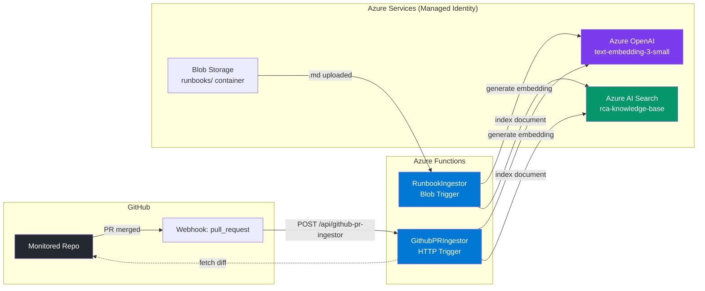

# Implementation Plan — Azure Functions Deployment & GitHub Webhook Setup

> **Goal**: Deploy the rewritten ingestion functions (PR Ingestor + Runbook Ingestor) to Azure and configure the GitHub webhook to trigger PR ingestion on every merged PR.

---

## Summary of Code Changes Already Made

The following files have been rewritten/updated in this session:

| File | What Changed |
|------|-------------|
| [function_app.py](file:///c:/Users/mooualla/OneDrive%20-%20Capgemini/Bureau/avancement/semaine3/iac-repo-azure/functions_code/function_app.py) | Switched from API keys to **Managed Identity** (`DefaultAzureCredential` + `get_bearer_token_provider`), added per-file diff fetching, service_affected inference, and relevant file filtering |
| [requirements.txt](file:///c:/Users/mooualla/OneDrive%20-%20Capgemini/Bureau/avancement/semaine3/iac-repo-azure/functions_code/requirements.txt) | Added `azure-identity` dependency |
| [modules/functions/main.tf](file:///c:/Users/mooualla/OneDrive%20-%20Capgemini/Bureau/avancement/semaine3/iac-repo-azure/modules/functions/main.tf) | Added `app_settings` for OpenAI/Search endpoints + GitHub secrets |
| [modules/functions/variables.tf](file:///c:/Users/mooualla/OneDrive%20-%20Capgemini/Bureau/avancement/semaine3/iac-repo-azure/modules/functions/variables.tf) | Added input variables for OpenAI, Search, GitHub config |
| [modules/functions/outputs.tf](file:///c:/Users/mooualla/OneDrive%20-%20Capgemini/Bureau/avancement/semaine3/iac-repo-azure/modules/functions/outputs.tf) | Added `function_app_name` and `function_app_default_hostname` outputs |
| [main.tf](file:///c:/Users/mooualla/OneDrive%20-%20Capgemini/Bureau/avancement/semaine3/iac-repo-azure/main.tf) | Wired functions module to receive OpenAI/Search endpoints + GitHub vars |
| [variables.tf](file:///c:/Users/mooualla/OneDrive%20-%20Capgemini/Bureau/avancement/semaine3/iac-repo-azure/variables.tf) | Added `search_index_name`, `github_webhook_secret`, `github_token` root vars |
| [outputs.tf](file:///c:/Users/mooualla/OneDrive%20-%20Capgemini/Bureau/avancement/semaine3/iac-repo-azure/outputs.tf) | Added `FUNCTION_APP_NAME` and `FUNCTION_APP_HOSTNAME` outputs |

### Key Architecture Decision: Managed Identity (No API Keys)

```diff
 # BEFORE — API keys stored in app settings
-AZURE_SEARCH_ADMIN_KEY = "d9sJB4jp6G..."
-AZURE_OPENAI_API_KEY   = "4a1ced26d1..."
-search_client = SearchClient(credential=AzureKeyCredential(KEY))
-openai_client = AzureOpenAI(api_key=KEY)

 # AFTER — Managed Identity via DefaultAzureCredential
+credential = DefaultAzureCredential()
+token_provider = get_bearer_token_provider(credential, "https://cognitiveservices.azure.com/.default")
+search_client = SearchClient(credential=credential)
+openai_client = AzureOpenAI(azure_ad_token_provider=token_provider)
```

This matches exactly how the [app-repo backend](file:///c:/Users/mooualla/OneDrive%20-%20Capgemini/Bureau/avancement/semaine3/app-repo/backend/src/core/config.py) authenticates with Azure services.

---

## Step-by-Step Deployment Guide

### Phase 1: Prerequisites

- [x] ~~Rewrite function code to use Managed Identity~~ ✅ Done
- [x] ~~Update Terraform module with app_settings~~ ✅ Done
- [ ] **Step 1.1** — Generate a GitHub Personal Access Token (PAT)
- [ ] **Step 1.2** — Generate a GitHub Webhook Secret
- [ ] **Step 1.3** — Install Azure Functions Core Tools (if not already)

#### Step 1.1 — Generate a GitHub PAT

The function needs a GitHub PAT with **`repo`** scope to fetch PR diffs via the REST API.

1. Go to [GitHub → Settings → Developer settings → Personal access tokens → Tokens (classic)](https://github.com/settings/tokens)
2. Click **"Generate new token (classic)"**
3. Set:
   - **Note**: `rca-pr-ingestor`
   - **Expiration**: 90 days (or your org policy)
   - **Scopes**: ✅ `repo` (full control of private repositories)
4. Click **"Generate token"**
5. **Copy the token immediately** — you won't see it again

> [!IMPORTANT]
> Save this token securely. You will use it as `github_token` in Terraform.

#### Step 1.2 — Generate a Webhook Secret

Generate a random high-entropy secret string for webhook signature validation:

```powershell
# Generate a random 40-character hex string
-join ((1..40) | ForEach-Object { '{0:x}' -f (Get-Random -Maximum 16) })
```

Or use Python:
```python
import secrets
print(secrets.token_hex(32))
```

> [!IMPORTANT]
> Save this secret. You will use it as `github_webhook_secret` in Terraform AND in the GitHub webhook configuration.

#### Step 1.3 — Install Azure Functions Core Tools

```powershell
# Check if already installed
func --version

# If not installed, install via npm
npm install -g azure-functions-core-tools@4 --unsafe-perm true

# Or via winget
winget install Microsoft.Azure.FunctionsCoreTools
```

---

### Phase 2: Apply Terraform Changes

> [!WARNING]
> This will update the existing Function App with new app_settings. Ensure you are authenticated with `az login` and in the correct subscription.

#### Step 2.1 — Create a `terraform.tfvars` file (or pass variables via CLI)

Create/update a `.tfvars` file with the GitHub secrets:

```hcl
# In: iac-repo-azure/environments/dev.tfvars (or terraform.tfvars)
github_webhook_secret = "YOUR_GENERATED_SECRET_FROM_STEP_1.2"
github_token          = "ghp_YOUR_TOKEN_FROM_STEP_1.1"
```

> [!CAUTION]
> **Never commit `.tfvars` files containing secrets to Git!** Add `*.tfvars` to your `.gitignore` if not already present.

#### Step 2.2 — Run Terraform Plan & Apply

```powershell
cd "C:\Users\mooualla\OneDrive - Capgemini\Bureau\avancement\semaine3\iac-repo-azure"

# Authenticate if needed
az login

# Plan — review changes carefully
terraform plan -var-file="environments/dev.tfvars"

# Apply
terraform apply -var-file="environments/dev.tfvars"
```

Expected changes:
- `azurerm_linux_function_app.ingestor` — **update in-place** (new `app_settings`)
- No new resources created (the function app already exists)

#### Step 2.3 — Capture Outputs

After apply, note these values:

```powershell
terraform output FUNCTION_APP_NAME
terraform output FUNCTION_APP_HOSTNAME
```

Example output:
```
FUNCTION_APP_NAME     = "func-ingestor-abc123"
FUNCTION_APP_HOSTNAME = "func-ingestor-abc123.azurewebsites.net"
```

---

### Phase 3: Deploy Function Code

#### Step 3.1 — Deploy via Azure Functions Core Tools

```powershell
cd "C:\Users\mooualla\OneDrive - Capgemini\Bureau\avancement\semaine3\iac-repo-azure\functions_code"

# Deploy to Azure (replace with your actual function app name from Step 2.3)
func azure functionapp publish func-ingestor-<SUFFIX>
```

> [!NOTE]
> The `--build remote` flag is implied for Python Linux function apps. Azure will install dependencies from `requirements.txt` automatically during deployment.

#### Step 3.2 — Verify Deployment

```powershell
# Check function app status
az functionapp show --name func-ingestor-<SUFFIX> --resource-group dev-env-rg --query "state"

# List deployed functions
az functionapp function list --name func-ingestor-<SUFFIX> --resource-group dev-env-rg --output table
```

Expected output — you should see **two functions**:
| Name | Trigger |
|------|---------|
| `RunbookIngestor` | blobTrigger |
| `GithubPRIngestor` | httpTrigger |

#### Step 3.3 — Get the Function URL (with key)

```powershell
# Get the function URL including the auth key
az functionapp function show \
  --name func-ingestor-<SUFFIX> \
  --resource-group dev-env-rg \
  --function-name GithubPRIngestor \
  --query "invokeUrlTemplate"
```

You also need the **function key** for the URL:

```powershell
az functionapp keys list \
  --name func-ingestor-<SUFFIX> \
  --resource-group dev-env-rg \
  --query "functionKeys"
```

The final webhook URL will be:
```
https://func-ingestor-<SUFFIX>.azurewebsites.net/api/github-pr-ingestor?code=<FUNCTION_KEY>
```

---

### Phase 4: Configure GitHub Webhook

#### Step 4.1 — Navigate to Webhook Settings

1. Go to your **monitored repository** on GitHub (the repo whose PRs you want to index)
   - e.g. `https://github.com/<org>/<monitored-repo>/settings/hooks`
2. Click **"Add webhook"**

#### Step 4.2 — Fill in Webhook Configuration

| Field | Value |
|-------|-------|
| **Payload URL** | `https://func-ingestor-<SUFFIX>.azurewebsites.net/api/github-pr-ingestor?code=<FUNCTION_KEY>` |
| **Content type** | `application/json` |
| **Secret** | The same secret you generated in Step 1.2 and put in `terraform.tfvars` |
| **SSL verification** | ✅ Enable SSL verification (always) |
| **Which events?** | Select **"Let me select individual events"** → check only **Pull requests** |
| **Active** | ✅ Checked |

#### Step 4.3 — Visual Guide

```
┌─────────────────────────────────────────────────────────────────┐
│  Add webhook                                                     │
│                                                                   │
│  Payload URL:                                                     │
│  ┌───────────────────────────────────────────────────────────┐   │
│  │ https://func-ingestor-abc123.azurewebsites.net/api/      │   │
│  │ github-pr-ingestor?code=aBcDeFg123...                    │   │
│  └───────────────────────────────────────────────────────────┘   │
│                                                                   │
│  Content type: [ application/json         ▾ ]                    │
│                                                                   │
│  Secret:                                                          │
│  ┌───────────────────────────────────────────────────────────┐   │
│  │ ●●●●●●●●●●●●●●●●●●●●●●●●●●●●●●●●●●●●                   │   │
│  └───────────────────────────────────────────────────────────┘   │
│                                                                   │
│  Which events would you like to trigger this webhook?            │
│  ○ Just the push event                                            │
│  ○ Send me everything                                             │
│  ● Let me select individual events                                │
│    ☐ Branch or tag creation     ☐ Check runs                     │
│    ☐ Check suites               ☐ Code scanning alerts           │
│    ☐ Commit comments            ☐ Discussions                    │
│    ☐ Forks                      ☐ Issues                         │
│    ☐ Issue comments             ☐ Labels                         │
│    ☐ Milestones                 ☐ Packages                       │
│    ☐ Page builds                ☑ Pull requests     ← CHECK     │
│    ☐ Pushes                     ☐ Releases                       │
│    ...                                                            │
│                                                                   │
│  ☑ Active                                                         │
│                                                                   │
│  [ Add webhook ]                                                  │
└─────────────────────────────────────────────────────────────────┘
```

#### Step 4.4 — Test the Webhook

After adding the webhook, GitHub sends a **ping event**. Check the delivery:

1. On the webhook page, scroll down to **"Recent Deliveries"**
2. You should see a `ping` event with a ✅ green checkmark (HTTP 200)
3. If it shows ❌ (401), your webhook secret doesn't match — verify it in both:
   - GitHub webhook settings
   - Function App settings (`GITHUB_WEBHOOK_SECRET`)

#### Step 4.5 — End-to-End Test with a Real PR

1. Create a test branch in your monitored repo
2. Make a small change to a relevant file (e.g. edit a `.py` or `.yml` file)
3. Open a PR and merge it into `main`
4. Check the webhook delivery on GitHub (should be ✅ 200)
5. Verify the document was indexed in Azure AI Search:

```powershell
# Quick check via Azure CLI
az search query \
  --service-name srch-rca-<SUFFIX> \
  --index-name rca-knowledge-base \
  --search-text "*" \
  --filter "doc_type eq 'github_pr'" \
  --select "id,content,service_affected,timestamp"
```

Or check the function logs:

```powershell
# Stream live logs from the function app
func azure functionapp logstream func-ingestor-<SUFFIX>
```

---

### Phase 5: Verify RBAC Roles (Already Configured)

The [identity module](file:///c:/Users/mooualla/OneDrive%20-%20Capgemini/Bureau/avancement/semaine3/iac-repo-azure/modules/identity/main.tf) already assigns these roles to the Function App's Managed Identity:

| Role | Target Resource | Purpose |
|------|----------------|---------|
| `Cognitive Services OpenAI User` | Azure OpenAI Account | Generate embeddings |
| `Search Index Data Contributor` | Azure AI Search | Index documents |
| `Storage Blob Data Contributor` | Storage Account | Read runbook blobs |

> [!TIP]
> If the function fails with `403 Forbidden`, RBAC role propagation can take up to **10 minutes** after Terraform apply. Wait and retry.

---

### Phase 6: Verify AI Search Authentication Mode

> [!IMPORTANT]
> Azure AI Search must have **"Role-based access control"** enabled for Managed Identity auth to work. By default, some search services only accept API keys.

```powershell
# Check current auth mode
az search service show \
  --name srch-rca-<SUFFIX> \
  --resource-group dev-env-rg \
  --query "authOptions"

# If needed, enable RBAC-based auth (allows both keys AND RBAC)
az search service update \
  --name srch-rca-<SUFFIX> \
  --resource-group dev-env-rg \
  --auth-options aadOrApiKey
```

---

## Troubleshooting Guide

| Symptom | Cause | Fix |
|---------|-------|-----|
| GitHub webhook returns **401** | Webhook secret mismatch | Verify `GITHUB_WEBHOOK_SECRET` in Function App settings matches GitHub |
| Function returns **500 "Search client error"** | `AZURE_SEARCH_ENDPOINT` not set | Check Function App → Configuration → Application Settings |
| Function logs show **403 on Azure OpenAI** | RBAC not propagated yet | Wait 10 min after `terraform apply`, or check role assignments in Portal |
| Function logs show **403 on Azure AI Search** | Search auth mode is API-key-only | Run `az search service update --auth-options aadOrApiKey` (see Phase 6) |
| Embedding returns empty `[]` | OpenAI endpoint/deployment mismatch | Verify `AZURE_OPENAI_EMBEDDING_DEPLOYMENT` matches actual deployment name |
| PR indexed but `code_diff` is empty | `GITHUB_TOKEN` not set or expired | Regenerate PAT and update Function App settings |

---

## Architecture Summary — What's Connected


