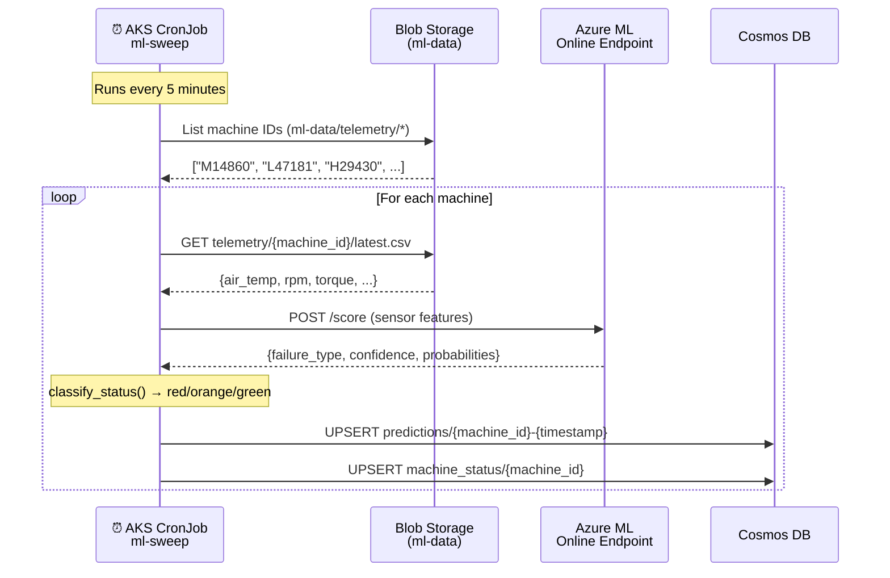
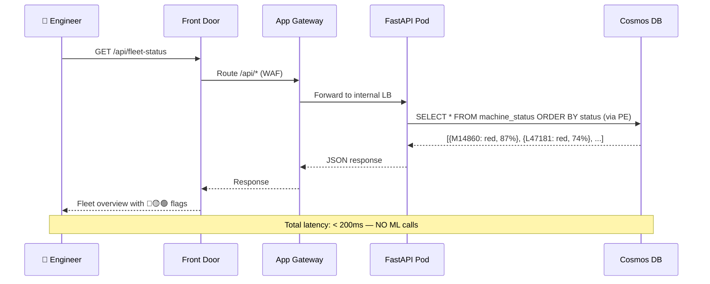
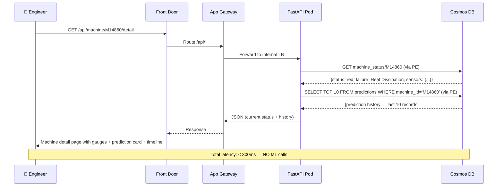
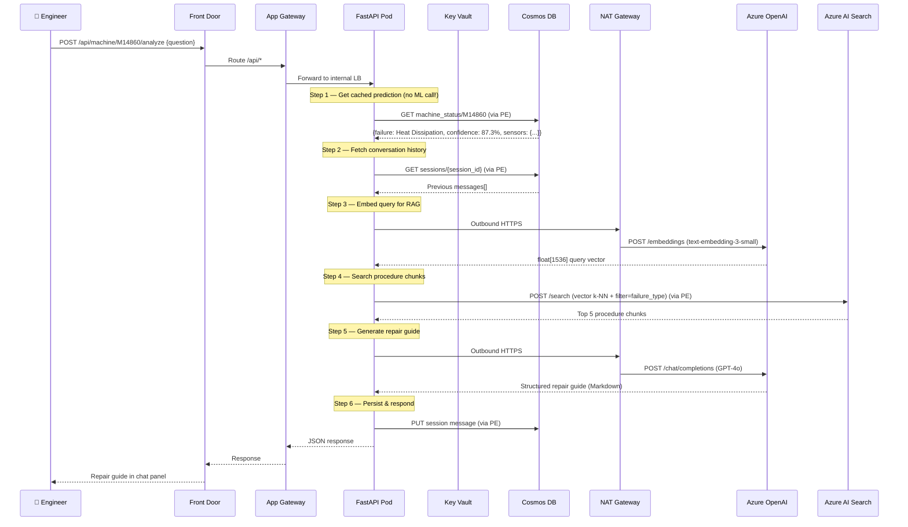

# Azure Predictive Maintenance Platform — Deep Dive v2

> Based on the **actual deployed infrastructure** from [state.txt](file:///c:/Users/mooualla/OneDrive%20-%20Capgemini/Bureau/avancement/semaine3/iac-repo-azure/state.txt), the architecture in [AZURE_ARCHITECTURE.md](file:///c:/Users/mooualla/OneDrive%20-%20Capgemini/Bureau/avancement/semaine3/iac-repo-azure/AZURE_ARCHITECTURE.md), and the pipeline design in [PIPELINE_ARCHITECTURE.md](file:///c:/Users/mooualla/OneDrive%20-%20Capgemini/Bureau/avancement/semaine3/iac-repo-azure/PIPELINE_ARCHITECTURE.md).

---

## Table of Contents

1. [Data Model — Proactive Prediction Storage](#1-data-model--proactive-prediction-storage)
2. [ML Worker — Background Prediction Sweep](#2-ml-worker--background-prediction-sweep)
3. [Web Application — UX & Feature Design](#3-web-application--ux--feature-design)
4. [Request Flows — All Three Paths](#4-request-flows--all-three-paths)
5. [AKS Pod Architecture](#5-aks-pod-architecture)
6. [Architecture Diagram](#6-architecture-diagram)
7. [Deployed Resource Inventory](#7-deployed-resource-inventory)
8. [Service Role Summary](#8-service-role-summary)
9. [Management & Operations Plane](#9-management--operations-plane)

---

## 1. Data Model — Proactive Prediction Storage

### The Core Design Decision

The user must **always** see up-to-date machine health statuses when they open the dashboard — they should never have to click "Analyze" to discover which machines are failing. This requires a **proactive sweep model**: predictions are computed in the background on a schedule and stored in Cosmos DB. The frontend simply reads the latest stored predictions.

### Why This Matters

| Approach | Behavior | Problem |
|---|---|---|
| **On-demand** (v1 design) | User selects a machine → clicks "Analyze" → waits 3–5s for ML inference | The user has **no idea** which machine to check. They would have to click every machine one by one to find problems. Unusable with 100+ machines. |
| **Proactive sweep** (v2 design) | Background job runs every 5 minutes → scores ALL machines → stores results in Cosmos DB → dashboard reads cached predictions instantly | User opens dashboard → instantly sees red/orange/green flags for every machine → clicks a red one → gets AI repair guide. **This is the correct UX.** |

### Cosmos DB Data Model

The `maintenance` database now contains **two** containers:

```
Cosmos DB: maintenance (database)
│
├── Container: predictions       ← NEW — machine health snapshots
│   Partition key: /machine_id
│   Documents:
│   {
│       "id": "M14860-2026-03-31T16:00:00Z",
│       "machine_id": "M14860",
│       "timestamp": "2026-03-31T16:00:00Z",
│       "sensor_snapshot": {
│           "air_temperature_K": 298.1,
│           "process_temperature_K": 308.6,
│           "rotational_speed_rpm": 1551,
│           "torque_Nm": 42.8,
│           "tool_wear_min": 108,
│           "type": "M"
│       },
│       "prediction": {
│           "failure_type": "Heat Dissipation Failure",
│           "confidence": 0.873,
│           "probabilities": {
│               "No Failure": 0.000,
│               "Heat Dissipation Failure": 0.873,
│               "Power Failure": 0.062,
│               "Overstrain Failure": 0.031,
│               "Tool Wear Failure": 0.020,
│               "Random Failures": 0.014
│           }
│       },
│       "status": "red",           ← derived: red/orange/green
│       "ttl": 86400                ← auto-expire after 24h
│   }
│
├── Container: machine_status     ← NEW — latest status per machine (one doc per machine)
│   Partition key: /machine_id
│   Documents:
│   {
│       "id": "M14860",
│       "machine_id": "M14860",
│       "last_sweep_at": "2026-03-31T16:00:00Z",
│       "status": "red",
│       "failure_type": "Heat Dissipation Failure",
│       "confidence": 0.873,
│       "sensor_summary": {
│           "air_temperature_K": 298.1,
│           "process_temperature_K": 308.6,
│           "rotational_speed_rpm": 1551,
│           "torque_Nm": 42.8,
│           "tool_wear_min": 108
│       }
│   }
│   ── This container is what the fleet overview page reads.
│   ── One document per machine, upserted every sweep.
│   ── Query: SELECT * FROM c ORDER BY c.status DESC  → red first.
│
└── Container: sessions           ← EXISTING — chat/conversation history
    Partition key: /session_id
    Documents:
    {
        "id": "uuid",
        "session_id": "sess-abc-123",
        "machine_id": "M14860",
        "messages": [ ... ],
        "created_at": "...",
        "last_message_at": "..."
    }
```

### Status Classification Logic

```python
def classify_status(prediction: dict) -> str:
    """
    Classify machine health into red/orange/green.
    Applied by the ML Worker after each prediction.
    """
    failure_type = prediction["failure_type"]
    confidence = prediction["confidence"]

    # GREEN — No failure predicted with high confidence
    if failure_type == "No Failure" and confidence >= 0.80:
        return "green"

    # RED — Failure predicted with high confidence
    if failure_type != "No Failure" and confidence >= 0.70:
        return "red"

    # ORANGE — Uncertain: low-confidence failure OR low-confidence no-failure
    return "orange"
```

| Status | Meaning | User Action |
|---|---|---|
| 🟢 **Green** | No failure predicted (≥80% confidence) | Monitor only |
| 🟡 **Orange** | Uncertain — model unsure, or low-confidence warning | Check when available |
| 🔴 **Red** | Failure predicted (≥70% confidence) | Investigate immediately — click for AI repair guide |

---

## 2. ML Worker — Background Prediction Sweep

### Do We Need a Separate Pod?

**Short answer: No permanent pod. Use an AKS CronJob.**

| Option | Pros | Cons | Verdict |
|---|---|---|---|
| **Separate long-running Deployment** | Always ready, low latency | Wastes resources when idle (24/7 pod for a job that runs 2 min every 5 min) | ❌ Overkill |
| **AKS CronJob** (Kubernetes CronJob) | Runs only when needed, scales to 0 between runs, uses the same container image as FastAPI (shared service layer), built into Kubernetes — no extra tooling | Slight cold start (~5s to pull cached image) | ✅ **Correct choice** |
| **Inline in FastAPI** (background task) | Simple, no extra workload | Ties sweep lifecycle to API pod lifecycle, HPA would scale API pods based on sweep load (wrong signal), hard to monitor separately | ❌ Wrong |

### CronJob Architecture

```
AKS Cluster — app-ns namespace
│
├── Deployment: fastapi          (always running, serves API requests)
│   Replicas: 2–8 (HPA based on CPU/requests per second)
│   Image: acr.azurecr.io/app:{sha}
│   Command: uvicorn app.main:app --host 0.0.0.0 --port 8080
│
├── CronJob: ml-sweep            (runs every 5 minutes)
│   Image: acr.azurecr.io/app:{sha}   ← SAME IMAGE as FastAPI
│   Command: python -m app.workers.sweep_all_machines
│   Schedule: "*/5 * * * *"
│   concurrencyPolicy: Forbid          ← prevents overlapping runs
│   successfulJobsHistoryLimit: 3
│   failedJobsHistoryLimit: 5
│   activeDeadlineSeconds: 240         ← kill if stuck > 4 min
│   restartPolicy: OnFailure
│
│   Resources:
│     requests: { cpu: 250m, memory: 256Mi }
│     limits:   { cpu: 500m, memory: 512Mi }
│
│   SecurityContext: (same as FastAPI — non-root, readOnlyRootFilesystem)
│
│   Environment: (same Key Vault CSI mounts as FastAPI)
│     COSMOS_PRIMARY_KEY, ML_ENDPOINT_URL, ML_STORAGE_KEY
│
└── Service: fastapi-svc         (ClusterIP → only the Deployment, not CronJob)
```

> **Key insight**: The CronJob uses the **exact same Docker image** as the FastAPI Deployment. It imports the same service layer (`cosmos_service.py`, `ml_service.py`, `blob_service.py`). The only difference is the entrypoint — instead of starting the web server, it runs the sweep script.

### Sweep Script Logic

```python
# app/workers/sweep_all_machines.py
"""
Background sweep — runs as AKS CronJob every 5 minutes.
Scores ALL machines against Azure ML endpoint, stores results in Cosmos DB.
"""

import asyncio
from app.services.blob_service import list_machines, get_latest_telemetry
from app.services.ml_service import predict_failure
from app.services.cosmos_service import upsert_prediction, upsert_machine_status

async def sweep():
    """
    1. List all machine IDs from Blob Storage (ml-data/telemetry/*)
    2. For each machine:
       a. Fetch latest sensor readings
       b. Call Azure ML Online Endpoint
       c. Classify status (red/orange/green)
       d. Write prediction to Cosmos DB 'predictions' container
       e. Upsert machine_status document (latest snapshot)
    """
    machine_ids = await list_machines()  # e.g., ["M14860", "L47181", "H29430", ...]

    for machine_id in machine_ids:
        try:
            # Fetch latest telemetry from Blob Storage
            telemetry = await get_latest_telemetry(machine_id)

            # Call Azure ML Online Endpoint for prediction
            prediction = await predict_failure(telemetry)

            # Classify into red/orange/green
            status = classify_status(prediction)

            # Write detailed prediction record (with TTL = 24h)
            await upsert_prediction(
                machine_id=machine_id,
                telemetry=telemetry,
                prediction=prediction,
                status=status
            )

            # Update the machine_status document (one per machine, upserted)
            await upsert_machine_status(
                machine_id=machine_id,
                status=status,
                prediction=prediction,
                telemetry=telemetry
            )

        except Exception as e:
            # Log error but don't stop sweep — continue to next machine
            logger.error(f"Sweep failed for {machine_id}: {e}")
            # Optionally: mark machine_status as "unknown"

    logger.info(f"Sweep complete: {len(machine_ids)} machines processed")

if __name__ == "__main__":
    asyncio.run(sweep())
```

### Sweep Data Flow



---

## 3. Web Application — UX & Feature Design

### 3.1 Two-Screen Design

The v2 dashboard has **two screens** instead of v1's single page. This reflects the proactive data model: the user first sees the fleet overview, then drills into a specific machine.

```
┌───────────────────────────────────────────────────────────────────────────┐
│                         SCREEN 1: FLEET OVERVIEW                          │
│                                                                           │
│  HEADER: Logo + "Predictive Maintenance Dashboard" + Last Sweep Timestamp │
│                                                                           │
│  ┌─────────┐ ┌─────────┐ ┌─────────┐                                     │
│  │ ■ 3 RED │ │ ■ 5 ORA │ │ ■ 42 GRN│  ← Summary counters                │
│  └─────────┘ └─────────┘ └─────────┘                                     │
│                                                                           │
│  MACHINE LIST (sorted: red first, then orange, then green)                │
│  ┌─────────────────────────────────────────────────────────────────────┐ │
│  │ 🔴 M14860  │ Heat Dissipation Failure │ 87.3% │ 2 min ago │ [VIEW] │ │
│  │ 🔴 L47181  │ Power Failure            │ 74.1% │ 3 min ago │ [VIEW] │ │
│  │ 🔴 H29430  │ Overstrain Failure       │ 71.5% │ 4 min ago │ [VIEW] │ │
│  │ 🟡 M28554  │ Tool Wear Failure        │ 42.0% │ 2 min ago │ [VIEW] │ │
│  │ 🟡 L98321  │ Random Failures          │ 38.7% │ 3 min ago │ [VIEW] │ │
│  │ 🟡 H15567  │ Heat Dissipation Failure │ 31.2% │ 4 min ago │ [VIEW] │ │
│  │ 🟡 M44210  │ No Failure               │ 55.0% │ 3 min ago │ [VIEW] │ │
│  │ 🟡 L72619  │ Power Failure            │ 28.4% │ 2 min ago │ [VIEW] │ │
│  │ 🟢 M10001  │ No Failure               │ 96.2% │ 2 min ago │ [VIEW] │ │
│  │ 🟢 ...     │ ...                      │ ...   │ ...       │ [VIEW] │ │
│  └─────────────────────────────────────────────────────────────────────┘ │
│                                                                           │
│  Data source: Cosmos DB 'machine_status' container (one query, instant)   │
└───────────────────────────────────────────────────────────────────────────┘

                    User clicks [VIEW] on M14860
                              │
                              ▼

┌───────────────────────────────────────────────────────────────────────────┐
│                    SCREEN 2: MACHINE DETAIL                               │
│                                                                           │
│  HEADER: [← Back to Fleet] + Machine M14860 + 🔴 Status Badge            │
│                                                                           │
│  ┌───────────────────────┬────────────────────────────────────────────┐  │
│  │                       │                                            │  │
│  │   LEFT PANEL          │   RIGHT PANEL                              │  │
│  │   Machine Health      │   AI Maintenance Assistant                 │  │
│  │                       │                                            │  │
│  │   • Sensor Gauges     │   • Chat Interface                         │  │
│  │     (4 radial + 1 bar)│   • Conversation History                   │  │
│  │                       │   • Suggested Questions                    │  │
│  │   • Prediction Card   │                                            │  │
│  │     (from Cosmos DB   │   [💬 "What caused this failure?"]         │  │
│  │      — pre-computed)  │   [🔧 "Step-by-step repair procedure"]    │  │
│  │                       │   [⚠️  "Is it safe to continue?"]         │  │
│  │   • Alert Timeline    │   [📋 "Preventive maintenance schedule"]   │  │
│  │     (prediction       │                                            │  │
│  │      history)         │                                            │  │
│  │                       │                                            │  │
│  └───────────────────────┴────────────────────────────────────────────┘  │
│                                                                           │
│  FOOTER: Session Info + Last Sweep at 16:00:05 UTC                        │
└───────────────────────────────────────────────────────────────────────────┘
```

### 3.2 Screen 1 — Fleet Overview (Reads from Cosmos DB only)

This screen makes **zero ML calls**. It reads entirely from the `machine_status` container — data that the CronJob already computed:

```
GET /api/fleet-status
    │
    └── FastAPI reads Cosmos DB: SELECT * FROM machine_status ORDER BY status
    └── Returns 50 machines with their pre-computed status in < 100ms
```

| Feature | Detail |
|---|---|
| **Summary counters** | Count of red/orange/green machines — prominent, color-coded |
| **Machine list** | Sorted by severity: 🔴 red first, then 🟡 orange, then 🟢 green |
| **Each row shows** | Machine ID, predicted failure type, confidence %, time since last sweep |
| **[VIEW] button** | Navigates to Screen 2 (Machine Detail) |
| **Auto-refresh** | Poll `/api/fleet-status` every 30 seconds OR use WebSocket for push updates |
| **Data source** | `Cosmos DB → machine_status` container — one query, instant response |

### 3.3 Screen 2 — Machine Detail (Reads from Cosmos DB + optional RAG)

When the user clicks a machine, Screen 2 loads **instantly** because the prediction is already in Cosmos DB. The user can **then** optionally use the AI chat to ask questions.

#### 📊 Sensor Gauges (Left Panel — Top)
- **4 radial gauges**: Air Temp, Process Temp, RPM, Torque
- **1 linear bar**: Tool Wear
- Data source: `machine_status` document (sensor_summary field)
- Color-coded: green = normal, yellow = threshold, red = critical
- **Loads instantly** — data already in Cosmos DB from the sweep

#### 🎯 Prediction Card (Left Panel — Middle)
```
┌─────────────────────────────────────┐
│  🔴  PREDICTED FAILURE              │
│                                     │
│  Heat Dissipation Failure           │
│  Confidence: 87.3%                  │
│                                     │
│  ████████░░  87%                    │
│                                     │
│  Other probabilities:               │
│  Power Failure ........... 6.2%     │
│  Overstrain .............. 3.1%     │
│  Tool Wear ............... 2.0%     │
│  Random .................. 1.4%     │
│  No Failure .............. 0.0%     │
│                                     │
│  Last checked: 2 min ago            │
│  [🔍 Ask AI for Repair Guide]       │
└─────────────────────────────────────┘
```
- Data source: `Cosmos DB → machine_status` — **no ML call needed**
- The **"Ask AI for Repair Guide"** button triggers the full RAG flow (Step 5–8 from v1)

#### 📋 Alert Timeline (Left Panel — Bottom)
- Shows the last 10 predictions for this machine from the `predictions` container
- Query: `SELECT TOP 10 * FROM predictions WHERE machine_id = 'M14860' ORDER BY timestamp DESC`
- Shows status changes over time — useful for spotting intermittent issues

#### 💬 AI Chat (Right Panel)
- Same design as v1 — only activated when the user clicks a suggested question
- The chat **automatically includes** the pre-computed prediction and sensor data in its context
- No need to re-run ML inference — it reads from Cosmos DB

### 3.4 API Endpoints

| Endpoint | Method | Source | Latency |
|---|---|---|---|
| `/api/fleet-status` | GET | Cosmos DB `machine_status` | < 100ms |
| `/api/machine/{machine_id}/detail` | GET | Cosmos DB `machine_status` + `predictions` (history) | < 150ms |
| `/api/machine/{machine_id}/analyze` | POST | Full RAG flow (OpenAI + AI Search) — only when user asks AI | 3–5s |
| `/health` | GET | K8s liveness probe | < 10ms |

### 3.5 Design Recommendations

| Recommendation | Rationale |
|---|---|
| Use **React Router** with 2 routes: `/` (fleet) and `/machine/:id` (detail) | Simple navigation, URL-shareable machine links |
| Use **CSS Grid** for Screen 1 list layout | Clean, responsive table without a table library |
| Use **CSS Grid** for Screen 2 two-panel layout | Same as v1 — 15 lines of CSS |
| **Auto-refresh** Fleet Overview every 30s | Keep the status board current without manual reload |
| **No auth UI** — Workload Identity handles API auth | One less thing to build |
| Use a **component library** (Chakra UI / Ant Design) | Pre-built gauges, cards, badges |
| Keep **color palette**: dark bg + green/orange/red + accent blue | Status colors are the primary visual language |

---

## 4. Request Flows — All Three Paths

v2 has **three distinct request flows**, not one. Each serves a different user scenario.

### Flow A — Fleet Status (Dashboard Load)

This is the **most common request** — every time the user opens or refreshes the dashboard:



**Services involved:**
- Azure Front Door → App Gateway → AKS → Cosmos DB (via Private Endpoint)
- **Zero calls to**: Azure ML, Azure OpenAI, Azure AI Search, Blob Storage

---

### Flow B — Machine Detail (Click a Machine)

The user clicks a red/orange machine to see its sensor readings and prediction details:



**Services involved:**
- Azure Front Door → App Gateway → AKS → Cosmos DB (via PE)
- **Zero calls to**: Azure ML, Azure OpenAI, Azure AI Search, Blob Storage
- All data was pre-computed by the CronJob

---

### Flow C — AI Repair Guide (User Asks the Chat)

Only triggered when the user **explicitly asks** for a repair guide. This is the full RAG flow:



**Key difference from v1**: Step 4 "ML Inference" is **removed**. The prediction is already in Cosmos DB from the CronJob sweep. The FastAPI pod reads the cached prediction instead of calling Azure ML — saving ~500ms and one external call.

---

### Flow Comparison Summary

| Flow | Trigger | ML Call? | OpenAI Call? | AI Search? | Latency |
|---|---|---|---|---|---|
| **A: Fleet Status** | Page load / refresh | ❌ | ❌ | ❌ | < 200ms |
| **B: Machine Detail** | Click a machine | ❌ | ❌ | ❌ | < 300ms |
| **C: AI Repair Guide** | User asks chat question | ❌ (reads cache) | ✅ Embeddings + GPT-4o | ✅ Vector search | 3–5s |
| **Background Sweep** | CronJob every 5 min | ✅ (for ALL machines) | ❌ | ❌ | 30s–2min |

---

## 5. AKS Pod Architecture

### Namespace Layout

```
AKS Cluster (Azure CNI, multi-AZ: AZ1 + AZ2)
│
├── Namespace: argocd-ns
│   └── ArgoCD (server + repo-server + application-controller)
│       Watches: gitops-repo → reconciles app-ns and ingress-con-ns
│
├── Namespace: app-ns
│   │
│   ├── Deployment: fastapi                                    ← API server
│   │   Replicas: 2–8 (HPA on CPU + request rate)
│   │   Image: {acr}/app:{git_sha}
│   │   Ports: 8080
│   │   Probes:
│   │     liveness:  GET /health (every 10s)
│   │     readiness: GET /health (every 5s)
│   │   Resources:
│   │     requests: { cpu: 250m, memory: 256Mi }
│   │     limits:   { cpu: "1", memory: 512Mi }
│   │   Security:
│   │     runAsNonRoot: true, readOnlyRootFilesystem: true
│   │   Volumes:
│   │     secrets-store-inline: Key Vault CSI mount
│   │   topologySpreadConstraints:
│   │     maxSkew: 1, topologyKey: topology.kubernetes.io/zone
│   │     ── Ensures pods spread across AZ1 and AZ2
│   │
│   ├── CronJob: ml-sweep                                     ← Background predictor
│   │   Schedule: "*/5 * * * *"  (every 5 minutes)
│   │   Image: {acr}/app:{git_sha}    ← SAME IMAGE as FastAPI
│   │   Command: ["python", "-m", "app.workers.sweep_all_machines"]
│   │   concurrencyPolicy: Forbid
│   │   activeDeadlineSeconds: 240
│   │   restartPolicy: OnFailure
│   │   Resources:
│   │     requests: { cpu: 250m, memory: 256Mi }
│   │     limits:   { cpu: 500m, memory: 512Mi }
│   │   Volumes:
│   │     secrets-store-inline: Key Vault CSI mount (same secrets)
│   │
│   ├── Service: fastapi-svc (ClusterIP → Deployment only)
│   │   Port: 8080 → targetPort: 8080
│   │   ── App Gateway routes here via internal LB
│   │
│   ├── HorizontalPodAutoscaler: fastapi-hpa
│   │   minReplicas: 2, maxReplicas: 8
│   │   Metrics: cpu (70%), custom: http_requests_per_second (50 rps)
│   │
│   ├── PodDisruptionBudget: fastapi-pdb
│   │   minAvailable: 1
│   │
│   └── SecretProviderClass: keyvault-secrets
│       Provider: azure
│       Parameters:
│         keyvaultName: kv-predmaint-{env}-{suffix}
│         objects:
│           - cosmos-primary-key
│           - ml-storage-primary-key
│           - ml-endpoint-url
│           - openai-api-key
│
└── Namespace: ingress-con-ns
    └── NGINX Ingress Controller
        Watches: Ingress resources in app-ns
        ── Routes external traffic from App Gateway to fastapi-svc
```

### Gitops Repository Structure (from PIPELINE_ARCHITECTURE.md — now fully specified)

```
gitops-repo/
├── base/
│   ├── app/
│   │   ├── Chart.yaml
│   │   └── templates/
│   │       ├── deployment.yaml           # FastAPI Deployment
│   │       ├── service.yaml              # fastapi-svc ClusterIP
│   │       ├── hpa.yaml                  # HorizontalPodAutoscaler
│   │       ├── pdb.yaml                  # PodDisruptionBudget
│   │       └── secretprovider.yaml       # Key Vault CSI mount
│   └── ml-worker/
│       ├── Chart.yaml
│       └── templates/
│           └── cronjob.yaml              # ml-sweep CronJob definition
├── apps/
│   ├── preprod/
│   │   ├── app/values.yaml               # image.tag, replicas, env-specific config
│   │   ├── ml-worker/values.yaml         # schedule, resource limits per env
│   │   └── ingress/values.yaml
│   └── prod/
│       ├── app/values.yaml
│       ├── ml-worker/values.yaml
│       └── ingress/values.yaml
└── argocd/
    ├── preprod-app.yaml
    └── prod-app.yaml
```

### ml-worker Helm Values (per environment)

```yaml
# apps/preprod/ml-worker/values.yaml
image:
  repository: acrpredmaintpreprod.azurecr.io/app   # same image as fastapi
  tag: "a1b2c3d"                                    # updated by app-repo CI
schedule: "*/5 * * * *"                              # every 5 min in preprod
activeDeadlineSeconds: 240
resources:
  requests:
    cpu: 250m
    memory: 256Mi
  limits:
    cpu: 500m
    memory: 512Mi
```

```yaml
# apps/prod/ml-worker/values.yaml
image:
  repository: acrpredmaintprod.azurecr.io/app
  tag: "d4e5f6g"
schedule: "*/5 * * * *"                              # every 5 min in prod too
activeDeadlineSeconds: 300                           # slightly more time for more machines
resources:
  requests:
    cpu: 500m
    memory: 512Mi
  limits:
    cpu: "1"
    memory: "1Gi"
```

---

## 6. Architecture Diagram

### Mermaid Diagram (updated for v2 — shows CronJob + Cosmos DB prediction flow)

```mermaid
graph TB
    subgraph INTERNET["🌐 Internet"]
        USER["👷 Maintenance Engineer<br/>Browser"]
    end

    subgraph EDGE["Azure Global Edge"]
        FD["Azure Front Door<br/>CDN + WAF Policy"]
    end

    subgraph BLOB_STATIC["Static Hosting"]
        FRONTEND["Blob Storage<br/>(frontend account)<br/>React SPA - $web container"]
    end

    subgraph VNET["Azure VNet 10.x.0.0/16"]
        subgraph PUBLIC["Public Subnets (AZ1 + AZ2)"]
            APPGW["Application Gateway<br/>WAF v2"]
            NAT1["NAT Gateway<br/>+ Public IP (AZ1)"]
            NAT2["NAT Gateway<br/>+ Public IP (AZ2)"]
        end

        subgraph PRIVATE["Private Subnets (AZ1 + AZ2)"]
            subgraph AKS_DETAIL["AKS Cluster — app-ns"]
                FASTAPI["Deployment: FastAPI<br/>(2–8 replicas, HPA)"]
                CRONJOB["CronJob: ml-sweep<br/>(every 5 min, same image)"]
            end
        end

        subgraph DATABASE["Database Subnets — Private Endpoints"]
            PE_COSMOS["PE: Cosmos DB"]
            PE_BLOB["PE: Blob Storage (ML Data)"]
            PE_SEARCH["PE: AI Search"]
            PE_KV["PE: Key Vault"]
            PE_ACR["PE: ACR"]
            PE_ML["PE: Azure ML"]
        end
    end

    subgraph PAAS["Azure PaaS Services"]
        COSMOS["Cosmos DB NoSQL Serverless<br/>(predictions + machine_status + sessions)"]
        BLOB_ML["Blob Storage (ML data)<br/>telemetry / procedures / prompts"]
        SEARCH["Azure AI Search<br/>(vector index)"]
        KV["Key Vault (secrets)"]
        ACR["Container Registry"]
        ML["Azure ML Workspace<br/>+ Online Endpoint"]
        APPINS_ML["App Insights (ML)"]
    end

    subgraph EXTERNAL["External Services (via NAT)"]
        OPENAI["Azure OpenAI<br/>GPT-4o + text-embedding-3-small"]
    end

    subgraph MONITORING["Monitoring"]
        LAW["Log Analytics Workspace"]
        APPINS["Application Insights"]
    end

    USER -->|"HTTPS"| FD
    FD -->|"/static/*"| FRONTEND
    FD -->|"/api/*"| APPGW
    APPGW -->|"Route to<br/>internal LB"| FASTAPI

    %% FastAPI reads cached predictions (Flows A & B)
    FASTAPI -->|"Read predictions<br/>(Flow A, B)"| PE_COSMOS
    PE_COSMOS --> COSMOS

    %% FastAPI RAG flow (Flow C only)
    FASTAPI -->|"RAG: embed + generate<br/>(Flow C)"| NAT1
    FASTAPI --> PE_SEARCH
    PE_SEARCH --> SEARCH

    %% CronJob sweep flow
    CRONJOB -->|"1. List machines"| PE_BLOB
    PE_BLOB --> BLOB_ML
    CRONJOB -->|"2. ML inference"| PE_ML
    PE_ML --> ML
    CRONJOB -->|"3. Store predictions"| PE_COSMOS

    %% Shared
    FASTAPI --> PE_KV
    CRONJOB --> PE_KV
    PE_KV --> KV
    ACR -.--->|"Image pull"| FASTAPI
    ACR -.--->|"Image pull"| CRONJOB
    PE_ACR --> ACR

    NAT1 -->|"HTTPS"| OPENAI
    NAT2 -->|"HTTPS"| OPENAI

    ML --> APPINS_ML
    FASTAPI --> APPINS
    APPINS --> LAW
    APPINS_ML --> LAW

    style VNET fill:#0d1b2a,stroke:#1b9aaa,stroke-width:2px
    style PUBLIC fill:#1b3a4b,stroke:#1b9aaa
    style PRIVATE fill:#1b3a4b,stroke:#6fffe9
    style AKS_DETAIL fill:#0f2b3a,stroke:#6fffe9,stroke-width:1px
    style DATABASE fill:#1b3a4b,stroke:#ff6b6b
    style EDGE fill:#2d1b69,stroke:#a855f7
    style MONITORING fill:#1e3a2f,stroke:#4ade80
    style EXTERNAL fill:#3b1f2b,stroke:#f472b6
```

---

## 7. Deployed Resource Inventory

Every resource in Terraform state, organized by module. **Changes from v1/v2 highlighted.**

### Spoke State (per environment — `preprod/terraform.tfstate`)

| Module | Resources | Count |
|---|---|---|
| **vnet** | VNet, 6 subnets, 3 NSGs, 6 NSG assoc, 2 NATs, 2 NAT IPs, 2 NAT assoc | 20 |
| **storage** | 2 Storage Accounts (frontend + ml_data), 1 lifecycle policy | 3 |
| **cosmos_db** | 1 Account, 1 SQL DB, **3 SQL Containers** (predictions + machine_status + sessions) | **5** ← was 3 |
| **key_vault** | 1 Key Vault, 1 access policy, **4 secrets** (+openai-api-key), 1 random suffix | **7** ← was 6 |
| **acr** | 1 Container Registry | 1 |
| **aks** | 1 AKS Cluster (**`private_cluster_enabled = true`**) | 1 |
| **ai_search** | 1 Search Service | 1 |
| **azure_ml** | 1 ML Workspace, 1 Compute Cluster, 1 App Insights | 3 |
| **application_gateway** | 1 App Gateway, 1 Public IP | 2 |
| **front_door** | 1 Profile, 1 Endpoint, 2 Origin Groups, 2 Origins, 2 Routes, 1 WAF Policy, 1 Security Policy | 8 |
| **private_endpoints** | 6 Private Endpoints, 6 DNS Zones, 6 VNet Links | 18 |
| **monitoring** | 1 Log Analytics Workspace, 1 App Insights | 2 |
| **vnet_peering** | **2 VNet Peerings (Spoke↔Hub), 1 AKS DNS Zone Link to Hub VNet** | **3** |
| | | **Spoke Total: 74 resources** |

### Hub State (shared — `hub/terraform.tfstate`)

| Resource | Description | Count |
|---|---|---|
| **Hub VNet** | `vnet-hub` (`10.10.0.0/16`) | 1 |
| **AzureBastionSubnet** | `/26` subnet — Azure-enforced name | 1 |
| **snet-management** | `/24` subnet for Jumpbox VM | 1 |
| **NSG (management)** | SSH from Bastion only + deny all inbound | 1 |
| **NSG association** | NSG → snet-management | 1 |
| **Public IP (Bastion)** | Static Standard SKU IP for Bastion | 1 |
| **Azure Bastion Host** | PaaS gateway — browser-based SSH tunnel | 1 |
| **NIC (Jumpbox)** | Network interface — no public IP | 1 |
| **Linux VM (Jumpbox)** | `Standard_B1s` — pre-installed with kubectl, helm, az cli | 1 |
| | | **Hub Total: 9 resources** |

> [!NOTE]
> **New Cosmos DB containers** (`predictions` + `machine_status`) are added to the existing `cosmos_db` Terraform module. The Azure ML Online Endpoint is deployed via CI/CD (ml-deploy pipeline), not Terraform. Azure OpenAI is deployed manually via Azure OpenAI Studio.

> [!IMPORTANT]
> **Hub vs Spoke state:** The Hub resources (Bastion, Jumpbox, Hub VNet) are deployed from a separate `hub/` Terraform root with its own state file (`hub/terraform.tfstate`). This ensures that `terraform destroy` on a Spoke environment never touches shared management infrastructure. The Hub is deployed **once per sandbox session**.

---

## 8. Service Role Summary

| Azure Service | Role in v2 Architecture | Accessed By | Access Method |
|---|---|---|---|
| **Front Door** | CDN + WAF. Routes `/static/*` to Blob, `/api/*` to App Gateway | Engineer browser | Public |
| **App Gateway WAF v2** | API entry, L7 LB, second WAF layer, routes to AKS internal LB | Front Door | Public IP |
| **NAT Gateway (×2)** | Outbound internet for pods (OpenAI calls, image pulls) | FastAPI pods | Outbound only |
| **AKS (FastAPI Deployment)** | API server — serves fleet status, machine detail, RAG chat. **Private cluster** — API Server has no public IP. | App Gateway | Internal LB |
| **AKS (ml-sweep CronJob)** | **Background predictor** — sweeps all machines every 5 min, stores results in Cosmos DB | Kubernetes scheduler | Internal |
| **AKS (rag-ingest CronJob)** | **RAG indexer** — chunks, embeds, and indexes procedure documents into AI Search on a weekly schedule | Kubernetes scheduler | Internal |
| **ACR** | Docker images for FastAPI + CronJobs (same image) | AKS kubelet | Private Endpoint |
| **Blob Storage (frontend)** | React SPA static hosting | Front Door | Public |
| **Blob Storage (ml-data)** | Telemetry CSVs, procedures, prompts | FastAPI + CronJobs | Private Endpoint |
| **Cosmos DB — `machine_status`** | **Latest status per machine** (one doc per machine, upserted by CronJob) | FastAPI (read), CronJob (write) | Private Endpoint |
| **Cosmos DB — `predictions`** | **Prediction history** per machine (new doc every sweep, TTL 24h) | FastAPI (read), CronJob (write) | Private Endpoint |
| **Cosmos DB — `sessions`** | Chat/conversation history for RAG context | FastAPI (read/write) | Private Endpoint |
| **Key Vault** | Secrets: DB keys, ML endpoint URL, OpenAI key | FastAPI + CronJobs (CSI mount) | Private Endpoint |
| **Azure ML Workspace** | ML lifecycle: experiments, model registry, endpoint management | CI/CD pipelines | Private Endpoint |
| **Azure ML Online Endpoint** | Hosts XGBoost classifier — called by CronJob (not by FastAPI) | **ml-sweep CronJob only** | Private Endpoint |
| **Azure AI Search** | Vector index of procedure chunks — used during RAG (Flow C) and indexed by rag-ingest CronJob | FastAPI + rag-ingest CronJob | Private Endpoint |
| **Azure OpenAI** | Embeddings + GPT-4o generation — used during RAG (Flow C) and embedding in rag-ingest | FastAPI + rag-ingest CronJob | Public (via NAT) |
| **Log Analytics** | Central log sink | All resources | Managed |
| **App Insights (×2)** | APM for AKS app + ML endpoint | AKS + Azure ML | Managed |
| **NSGs (×4)** | Firewall rules per subnet tier (public, private, database, **management**) | All tiers | N/A |
| **Private DNS Zones (×6+)** | Resolve PaaS hostnames to private IPs. AKS Private DNS Zone auto-created. | VNet-linked (Spoke + Hub) | Internal |
| **Hub VNet** | Isolated management network peered to Spoke VNets | Bastion + Jumpbox | VNet Peering |
| **Azure Bastion** | PaaS gateway — provides secure browser-based SSH tunneling into private VMs | Engineers (Portal) | Public (Bastion public IP) |
| **Jumpbox VM** | `Standard_B1s` Linux VM with kubectl, helm, az cli. No public IP — only reachable via Bastion. | Engineers (via Bastion) | Private (snet-management) |

---

## 9. Management & Operations Plane

How engineers and administrators interact with the **fully private** AKS environment safely.

### 9.1 Private Cluster Architecture

The AKS cluster is configured with **`private_cluster_enabled = true`**. This means:

- The Kubernetes API Server has **NO public IP address**.
- Azure automatically creates a **Private Endpoint** inside the Spoke VNet for the API Server.
- Azure automatically creates a **Private DNS Zone** (`privatelink.<region>.azmk8s.io`) linked to the Spoke VNet.
- Any attempt to reach the API Server from the public internet is **physically impossible** — the hostname resolves to a private IP (`10.x.x.x`) that is not routable outside the VNet.

### 9.2 The Dual Access Model

Because the API Server is private, we need two distinct paths for two distinct use cases:

#### Path 1: CI/CD Automation — `az aks command invoke` (Programmatic)

GitHub Actions runners are public machines that cannot reach the private API Server directly. Instead, we use the **`az aks command invoke`** proxy:

```bash
# Instead of:
#   az aks get-credentials ...
#   kubectl get nodes

# We use:
az aks command invoke \
  --resource-group $RESOURCE_GROUP \
  --name aks-predictive-maintenance-preprod \
  --command "kubectl get nodes"
```

**How it works:**
1. The GitHub runner sends the command to **Azure Resource Manager (ARM)** — a public API at `management.azure.com`.
2. ARM authenticates the request (Service Principal or OIDC).
3. ARM internally relays the command through Azure's backbone network to the private AKS API Server.
4. The result is returned back through ARM to the runner.
5. **The runner never needs a direct network route to the private cluster.**

| Pipeline Step | Old (Public Cluster) | New (Private Cluster) |
|---|---|---|
| Smoke test | `kubectl get nodes` | `az aks command invoke --command "kubectl get nodes"` |
| RAG ingestion trigger | `kubectl create job rag-ingest-{sha}` | `az aks command invoke --command "kubectl create job rag-ingest-{sha} --from=cronjob/rag-ingest"` |
| Health check | `curl /health` | `curl /health` (unchanged — reaches app via Front Door, not API Server) |

#### Path 2: Human Engineers — Azure Bastion + Jumpbox VM (Interactive)

For interactive debugging (`kubectl logs -f`, `kubectl exec -it`, `kubectl port-forward`), `az aks command invoke` is insufficient — it does not support streaming or interactive sessions. Engineers need to be **physically inside the VNet**.

**Network Topology:**

```
┌─────────────────────────────────────────────────────────────────┐
│  Hub VNet (10.10.0.0/16) — Deployed once via hub/ Terraform    │
│                                                                 │
│  ┌─────────────────────────────┐  ┌──────────────────────────┐ │
│  │  AzureBastionSubnet         │  │  snet-management         │ │
│  │  10.10.0.0/26               │  │  10.10.1.0/24            │ │
│  │                             │  │                          │ │
│  │  ┌───────────────────────┐  │  │  ┌────────────────────┐  │ │
│  │  │  Azure Bastion Host   │──┼──┼─▶│  Jumpbox VM (B1s)  │  │ │
│  │  │  (PaaS Gateway)       │  │  │  │  • kubectl         │  │ │
│  │  │  Public IP: ✅        │  │  │  │  • helm            │  │ │
│  │  └───────────────────────┘  │  │  │  • az cli           │  │ │
│  │                             │  │  │  Public IP: ❌      │  │ │
│  └─────────────────────────────┘  │  └────────┬───────────┘  │ │
│                                   └────────────┼──────────────┘ │
└────────────────────────────────────────────────┼────────────────┘
                    VNet Peering                 │
┌────────────────────────────────────────────────┼────────────────┐
│  Spoke VNet (10.x.0.0/16) — Per environment                    │
│                                                │                │
│  ┌──────────────────────────────────────────────┼──────────────┐│
│  │  snet-private (AKS Nodes)                    │              ││
│  │                                              ▼              ││
│  │  ┌─────────────────────────────────────────────────────┐    ││
│  │  │  AKS Private API Server (10.0.x.x)                  │    ││
│  │  │  kubectl get nodes → ✅ Works from Jumpbox           │    ││
│  │  └─────────────────────────────────────────────────────┘    ││
│  └─────────────────────────────────────────────────────────────┘│
└────────────────────────────────────────────────────────────────┘
```

**The Human Access Flow:**
1. Engineer opens **Azure Portal** → navigates to the Jumpbox VM.
2. Clicks **"Connect via Bastion"** → a browser-based SSH terminal opens.
3. Inside the terminal: `az login` → `az aks get-credentials` → `kubectl get pods`.
4. Because the Jumpbox is in the Hub VNet (peered to the Spoke), and the AKS Private DNS Zone is linked to the Hub VNet, `kubectl` resolves the private hostname and connects successfully.

**Security Controls:**
- The Jumpbox has **no public IP** — it is invisible to the internet.
- The Management NSG only allows **SSH (port 22) from the AzureBastionSubnet CIDR** and denies all other inbound traffic.
- Azure Bastion encrypts the session with TLS — no SSH keys leave the Azure Portal.
- All access requires **Entra ID (Azure AD)** authentication.

### 9.3 Hub-and-Spoke Terraform State Isolation

The management infrastructure (Hub VNet, Bastion, Jumpbox) is deployed from a **separate Terraform root** (`hub/`) with its own state file. This ensures:

1. `terraform destroy` on Preprod **never** touches the Hub.
2. `terraform destroy` on Prod **never** touches the Hub.
3. The Hub is deployed **once per sandbox session**, before any Spoke.

```
iac-repo-azure/
├── hub/                          ← Separate Terraform root (state: hub/terraform.tfstate)
│   ├── main.tf                   ← Hub VNet + Bastion + Jumpbox
│   ├── variables.tf
│   └── outputs.tf
│
├── main.tf                       ← Spoke root (state: preprod/ or prod/terraform.tfstate)
│   ├── module "vnet"             ← Spoke VNet
│   ├── module "aks"              ← Private AKS Cluster
│   ├── data "terraform_remote_state" "hub"  ← Reads Hub VNet ID
│   ├── azurerm_virtual_network_peering      ← Spoke→Hub + Hub→Spoke
│   └── azurerm_private_dns_zone_virtual_network_link  ← AKS DNS → Hub
```

**Deployment Order:**
```bash
# Step 1 — Once per sandbox session
cd hub/
terraform init -backend-config="key=hub/terraform.tfstate" ...
terraform apply

# Step 2 — Per environment
cd ..
terraform init -backend-config="key=preprod/terraform.tfstate" ...
terraform apply -var-file=environments/preprod.tfvars
```

### 9.4 GitOps (ArgoCD) — Unaffected by Private Cluster

ArgoCD runs **inside** the AKS cluster as a pod in the `argocd-ns` namespace. It uses a **Pull model**:
- ArgoCD polls the `gitops-repo` on GitHub every 3 minutes.
- When it detects a change, it applies the new manifests from **within** the cluster.
- Because ArgoCD is already inside the VNet, it reaches the AKS API Server via the internal Kubernetes service (`kubernetes.default.svc`).
- **Zero changes required** — ArgoCD is completely unaffected by the private cluster transition.

### 9.5 What Changed vs v1

| Aspect | v1 (Public Cluster) | v2 (Private Cluster) |
|---|---|---|
| AKS API Server | Public IP — visible to internet | Private Endpoint — no public IP |
| `kubectl` from laptop | ✅ Direct (via Entra ID) | ❌ Blocked — must use Bastion→Jumpbox |
| `kubectl` from CI/CD | ✅ Direct | ✅ Via `az aks command invoke` proxy |
| ArgoCD deployments | ✅ Internal | ✅ Internal (unchanged) |
| Terraform apply | ✅ ARM API (public) | ✅ ARM API (unchanged) |
| Security posture | Auth only (Entra ID) | Auth **+ Network isolation** (defense in depth) |
| Management infra | None | Hub VNet + Bastion + Jumpbox (9 resources) |

---

> [!IMPORTANT]
> **Key Management Rules:**
> - **Infrastructure Changes** → Terraform (`iac-repo-azure` — Spoke root or `hub/` root)
> - **Application Deployments** → GitOps (`gitops-repo` → ArgoCD auto-sync)
> - **CI/CD Cluster Commands** → `az aks command invoke` (through ARM proxy)
> - **Interactive Debugging** → Azure Portal → Bastion → Jumpbox → `kubectl`

---

*End of Platform Deep Dive v2*
